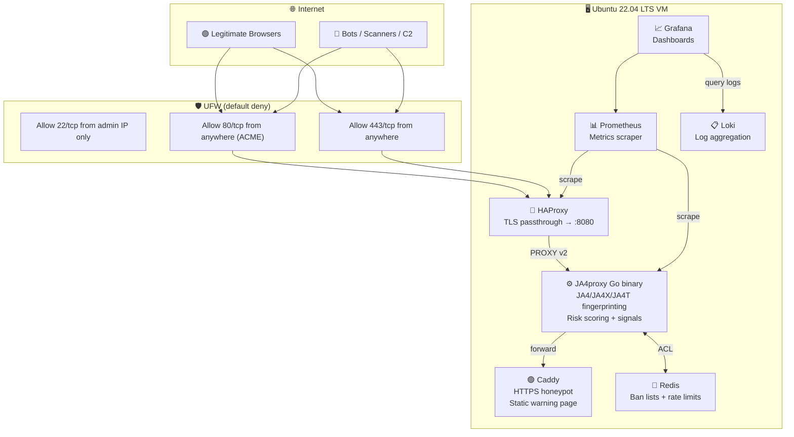

# JA4proxy Testing — Automated Research Honeypot Deployment

> Deploy a JA4 TLS fingerprinting proxy behind an internet-facing honeypot in one command.
> Verify everything locally before a single port hits the public internet.

```
Internet → HAProxy (:443 TLS passthrough) → JA4proxy (:8080 L4 interceptor)
                                                        ↓
                                                   Redis (:6379 bans)
                                                        ↓
                                                   Caddy (:8081 HTTPS honeypot)

Monitoring: Prometheus scrapes JA4proxy + HAProxy metrics
            Grafana dashboards ← Prometheus + Loki
            Loki ← Promtail (journald + Docker logs)
```

**This is a research/test environment only.** It collects no real PII, blocks nothing by default, and is designed to validate JA4proxy's effectiveness against real-world bot/attacker traffic before production deployment.

---

## Architecture



### Components

| Component | Type | Port | Access |
|-----------|------|------|--------|
| **JA4proxy** | Go binary (systemd) | 8080 (proxy), 9090 (metrics) | Internal only |
| **HAProxy** | Docker container | 443, 80 (public), 8404 (stats) | Public (go-live) |
| **Redis** | Docker container | 6379 | Internal network only |
| **Caddy** | Docker container | 8081 (internal) | Via HAProxy |
| **Prometheus** | Docker container | 9091 (host) | Admin IP only |
| **Grafana** | Docker container | 3000 (host) | Admin IP only |
| **Loki** | Docker container | 3100 | Internal network only |
| **Promtail** | Docker container | — | Internal network only |

---

## Staged Deployment Model

**No public ports until you say so.** The system deploys in a locked-down state, you verify everything works via SSH, then go-live opens the doors.

| Stage | Port Bindings | TLS | UFW 80/443 | How You Access |
|-------|--------------|-----|------------|---------------|
| **locked** (default) | `127.0.0.1` only | Self-signed | ❌ Closed | SSH tunnel |
| **verified** | `127.0.0.1` only | Self-signed | ❌ Closed | SSH tunnel (confirmed) |
| **live** | `0.0.0.0` (public) | Let's Encrypt | ✅ Open | Direct HTTPS |

### Why This Matters

1. **`make deploy`** → Everything installs behind a firewall. Port 443 is bound to `127.0.0.1`. Caddy uses self-signed certs. UFW blocks public access to 80/443.
2. **`make verify VM_IP=x`** → 25+ health checks run ON the VM via SSH. System services, all 7 containers, full pipeline test, network isolation, dial=0 confirmation.
3. **`make go-live VM_IP=x`** → Only then does it rebind ports to `0.0.0.0`, switch to production Let's Encrypt certs, and open UFW 80/443.

### SSH Tunnel Access (Locked Mode)

```bash
# Grafana
ssh -L 3000:127.0.0.1:3000 root@<VM_IP>
# Open: http://localhost:3000  (admin / see .vault/secrets.yml)

# Prometheus
ssh -L 9091:127.0.0.1:9091 root@<VM_IP>
# Open: http://localhost:9091

# Logs
ssh root@<VM_IP> "journalctl -u ja4proxy -f"
ssh root@<VM_IP> "docker compose -f /opt/ja4proxy-docker/docker-compose.yml logs -f"
```

---

## Quick Start

### Option A: From Zero to Live (Alibaba Cloud)

```bash
# 1. Provision VM (VPC, security group, ECS, EIP — 2 minutes)
make cloud ALIYUN_ARGS="--region eu-central-1 --instance-type ecs.g7.large \
  --ssh-key-name my-key-pair --admin-ip 1.2.3.4 \
  --domain test-honeypot.example.com"

# 2. Generate secrets (stored in deploy/.vault/secrets.yml, gitignored)
make secrets

# 3. Deploy (locked down, no public ports)
make deploy
# → prompts for domain, VM IP, admin IP, SSH key, Go repo path

# 4. Verify (25+ checks run on the VM via SSH)
make verify VM_IP=47.254.123.45
# → ✅ All 25 checks passed. Ready for go-live.

# 5. Go live (open ports, production TLS)
make go-live VM_IP=47.254.123.45
# → 🚀 GO-LIVE COMPLETE. System is now publicly accessible.
```

### Option B: Existing VM

```bash
# 1. Generate secrets
make secrets

# 2. Deploy (prompts for inputs)
make deploy
```

### Option C: CI/CD (No Prompts)

```bash
JA4PROXY_DOMAIN=test.example.com \
JA4PROXY_VM_HOST=47.254.123.45 \
JA4PROXY_ADMIN_IP=1.2.3.4 \
JA4PROXY_SSH_PUBLIC_KEY="ssh-ed25519 AAAA..." \
JA4PROXY_BUILD_MACHINE_GO_PATH=/home/user/JA4proxy \
make ci-deploy
```

---

## Prerequisites

### Control Machine

| Requirement | Why | Install |
|-------------|-----|---------|
| **Ansible 2.14+** | Orchestration | `pip install ansible` |
| **SSH key** | VM access | `ssh-keygen -t ed25519` |
| **Go toolchain** (optional) | Build JA4proxy binary | `go install` — or provide pre-built binary |

### Alibaba Cloud (for VM provisioning)

| Requirement | Why | Install |
|-------------|-----|---------|
| **`aliyun` CLI** | VM provisioning | `pip install aliyun-cli` |
| **Credentials** | API access | `aliyun configure` or `ALIBABACLOUD_ACCESS_KEY_ID` env |
| **SSH key pair** | Injected at instance creation | Create in ECS console or `aliyun ecs CreateKeyPair` |

### Ansible Collections (auto-installed on first run)

| Collection | Modules Used |
|------------|-------------|
| `community.general` | UFW, debconf |
| `community.docker` | Docker Compose v2 |
| `ansible.posix` | sysctl, authorized_key |

---

## What Gets Deployed

### Phase 1: VM Provisioning & Hardening
- System update + base packages (ufw, fail2ban, Docker, apparmor, aide)
- Dedicated `ja4proxy` system user (nologin, no home)
- SSH key installation + SSH hardening (key-only, no root, MaxAuthTries 3)
- UFW firewall (default deny, SSH from admin IP only, 80/443 only in live mode)
- Fail2ban for SSH brute force protection
- Docker installation with hardened daemon.json
- File descriptor limits (65536 for ja4proxy), sysctl tuning

### Phase 2: Artifact Preparation & Config
- JA4proxy Go binary (built from source or pre-built, checksum verified)
- All configuration files deployed from Jinja2 templates
- GeoIP database (IP2Location LITE) for country/ASN classification
- Docker Compose stack definition

### Phase 3: JA4proxy Deployment
- systemd service with 15+ security hardening flags
- Redis Docker wrapper for systemd dependency management
- Health endpoint verification (/health, /health/deep, /metrics)

### Phase 4: Supporting Services (Docker Compose)
- HAProxy (TLS passthrough + PROXY v2)
- Redis (internal network, auth, maxmemory policy)
- Caddy (HTTPS honeypot with warning page)
- Prometheus (metrics scraping)
- Grafana (dashboards)
- Loki (log aggregation)
- Promtail (log shipping from journald + Docker)

### Phase 5: Data Collection
- 7 Grafana dashboards (overview, TLS analysis, geographic, bot detection, performance, honeypot, trends)
- journald retention (90 days, 2GB max)
- 15+ Prometheus metrics (counters, gauges, histograms)

### Phase 6: Operational Security
- Health check script (daily cron)
- Alerting service template (OnFailure notification)
- Backup script (configs only — VM is disposable)
- Artifact verification script (integrity check)

### Phase 7: Validation
- Full HTTPS pipeline test
- Controlled traffic generation (curl, openssl)
- Network isolation verification (Redis/Loki cannot reach internet)

### Phase 8: Security Hardening
- sysctl network + process hardening
- AppArmor mandatory access control for JA4proxy binary
- Kernel module lockdown (unnecessary modules blocked)
- AIDE file integrity monitoring initialized

### Phase 9: Image Digest Pinning
- Resolve Docker image SHA-256 digests
- Prevent supply chain attacks via tag mutation
- Save digests to `image-digests.yml` for audit trail

### Phase 10: Go Live
- Re-bind Docker ports to `0.0.0.0` (public)
- Switch Caddy from self-signed to production Let's Encrypt
- Open UFW 80/443
- Verify public HTTPS access

---

## Operations

### Daily Checks (1 minute)
```bash
make status VM_IP=<ip>
```

### Dead-man's-switch heartbeat

Set `JA4PROXY_HEARTBEAT_URL` to a [healthchecks.io](https://healthchecks.io)
(or compatible) check URL and the deploy will install a systemd timer
that pings it every 5 minutes. If the VM falls off the net — compromised,
unpaid, rebooted into a wedged state — you get a push alert within
one ping interval. Budget alerts (see `docs/phases/RUNBOOK.md` →
"Budget alert setup") catch the *cost* failure mode; the heartbeat
catches the *availability* one.

### Cost guard

`make cloud` refuses to provision without `--confirm`, printing an
indicative monthly EUR estimate first. See the runbook's "Budget
alert setup" section for the Alibaba-console follow-up that turns
the warning into an actual spend cap.

### Change Dial Setting (Gradual Enforcement)
```bash
# Current dial (0 = monitor, 100 = full block)
ssh root@<ip> "curl -s http://127.0.0.1:9090/metrics | grep ja4proxy_dial_current"

# Increase dial
ssh root@<ip> "sed -i 's/dial: [0-9]*/dial: 20/' /opt/ja4proxy/config/proxy.yml"
ssh root@<ip> "kill -SIGHUP \$(pidof ja4proxy)"
```

### Partial Deployments
```bash
make check          # Dry run — see what would change
make cloud          # Provision Alibaba Cloud VM
make digests        # Pin Docker image SHA-256 digests
make verify         # Run 25+ local health checks via SSH
make go-live        # Open ports to public
make docker         # Docker Compose only
make validate       # Smoke tests only
make harden         # Security hardening only
make secrets        # Generate/review secrets
make destroy        # Stop all Docker containers
```

---

## Project Structure

```
deploy/
├── Makefile                          # All operational commands
├── README.md                         # Detailed operational guide
├── ansible.cfg                       # Ansible defaults
├── inventory/
│   ├── hosts.ini                     # Dynamic inventory (populated by provisioning)
│   └── group_vars/all.yml            # 137 configurable variables with defaults
├── playbooks/
│   └── site.yml                      # Master playbook (vars_prompt + 10 roles)
├── roles/
│   ├── 01-vm-provisioning/           # Packages, SSH, UFW, Fail2ban, Docker
│   ├── 02-artifact-build/            # Build binary, deploy configs, GeoIP
│   ├── 03-ja4proxy-deploy/           # systemd service, health checks
│   ├── 04-supporting-services/       # Docker Compose (7 containers)
│   ├── 05-data-collection/           # Grafana dashboards, journald
│   ├── 06-operational-security/      # Scripts, cron, alerting
│   ├── 07-validation/                # Smoke tests, network isolation
│   ├── 08-hardening/                 # sysctl, AppArmor, AIDE
│   ├── 09-image-digests/             # SHA-256 digest pinning
│   └── 10-go-live/                   # Open ports, production TLS
├── scripts/
│   ├── generate-secrets.sh           # Idempotent password generation
│   ├── provision-alibaba-cloud.sh    # Full VM provisioning (VPC, ECS, EIP)
│   ├── health-check.sh               # Daily health check (cron)
│   └── verify-local.sh               # 25+ local verification checks
├── templates/                        # 21 Jinja2 templates for all configs
└── files/                            # Grafana dashboards, static files

docs/phases/
├── PHASE_00_OVERVIEW.md              # Architecture, component inventory
├── PHASE_01_VM_PROVISIONING.md       # VM setup, hardening
├── PHASE_02_ARTIFACT_PREPARATION.md  # Build, config prep, transfer
├── PHASE_03_JA4PROXY_DEPLOYMENT.md   # systemd service, health checks
├── PHASE_04_SUPPORTING_SERVICES.md   # Docker Compose stack
├── PHASE_05_DATA_COLLECTION.md       # Research plan, metrics, retention
├── PHASE_06_OPERATIONAL_SECURITY.md  # Access, alerting, incident response
├── PHASE_07_VALIDATION_TESTING.md    # Testing, dial escalation
├── PHASE_08_SECURITY_HARDENING.md    # STRIDE, kernel, container security
├── ANSIBLE_BUILD_PLAN.md             # 29-task decomposition for implementation
├── DEPLOYMENT_ANALYSIS.md            # Duplication analysis vs JA4proxy4
└── RUNBOOK.md                        # Rollback procedures, troubleshooting
```

---

## Data Collected

| Layer | What | Purpose |
|-------|------|---------|
| **TLS** | JA4/JA4X/JA4T fingerprints, TLS version, ciphers, extensions, ALPN, SNI | Bot/toolkit identification |
| **Network** | Source IP, GeoIP country, ASN, datacenter vs residential, Tor flag | Geographic + infrastructure profiling |
| **Behavioral** | Connection rate, beaconing score, probing patterns, burst detection, connection lifespan | Attack pattern recognition |
| **Decision** | Risk score (0-100), action taken, block reason, counterfactual action | Effectiveness measurement |
| **Operational** | Pipeline latency, connection errors, Redis ops, tarpit stats, config reloads | Proxy reliability validation |

**No PII is collected.** The honeypot form explicitly requests fake data and discards all submissions. IP addresses are logged for operational purposes only. 90-day retention for metrics/logs, 5-minute TTL for Redis bans.

---

## Dial Escalation Plan

Start at dial=0 (monitor-only) and gradually increase enforcement as you validate data quality:

| Week | Dial | Behavior | What to Check |
|------|------|----------|---------------|
| 1-2 | 0 | Log everything, block nothing | Baseline fingerprints, geographic distribution |
| 2-3 | 20 | Flag suspicious | False positive rate, counterfactual accuracy |
| 3-4 | 40 | Rate limit suspicious | Rate limiting effectiveness |
| 4-5 | 55 | Tarpit suspicious | Tarpit resource waste on attackers |
| 5-6 | 70 | Block blacklisted | Block accuracy, no legitimate users blocked |
| 6+ | 85 | Ban repeat offenders (5-min auto-expire) | Ban lifecycle, false positive impact |
| 7+ | 100 | Full enforcement | Maximum protection |

At each stage, analyze counterfactual logs to answer "what would have happened if dial was higher?"

---

## Alibaba Cloud Instance Sizing

| Instance | vCPU | RAM | Storage | Monthly Cost (est.) | Use Case |
|----------|------|-----|---------|-------------------|----------|
| `ecs.g7.large` | 2 | 8GB | 40GB ESSD | ~€25 | Starting point, low-moderate traffic |
| `ecs.g7.xlarge` | 4 | 16GB | 60GB ESSD | ~€50 | High traffic, extended log retention |
| `ecs.g7.2xlarge` | 8 | 32GB | 80GB ESSD | ~€100 | Heavy attack volume, research scaling |

---

## Relationship to JA4proxy4

| Aspect | JA4proxy4 | JA4proxy-testing |
|--------|-----------|------------------|
| **Purpose** | Enterprise production deployment | Research honeypot validation |
| **Target** | Existing infrastructure (K8s, RHEL, enterprise) | Fresh internet-facing VM from scratch |
| **Stack** | JA4proxy binary only (existing infra assumed) | Full stack: HAProxy + Caddy + Redis + Prometheus + Grafana + Loki |
| **Monitoring** | Full: Datadog, Dynatrace, Nagios, Zabbix, Alertmanager | Research: Grafana + Loki only |
| **Deployment** | Enterprise Ansible + Helm + Terraform | Research Ansible + Docker Compose |

**This repo does NOT duplicate JA4proxy4's enterprise roles.** It focuses on the research-specific infrastructure (honeypot stack, staged deployment, validation) that doesn't exist in the production repo.

---

## Troubleshooting

| Problem | Diagnosis | Fix |
|---------|-----------|-----|
| SSH connection refused | Security group or UFW blocking | Check Alibaba Cloud security group; verify UFW allows your IP on 22 |
| `make deploy` fails at collections | No internet on control machine | `ansible-galaxy collection install community.general community.docker ansible.posix` |
| Docker pull timeout | Slow network or Docker Hub rate limit | Re-run — images cache on retry |
| Caddy TLS cert fails | DNS not propagated or port 80 blocked | Verify DNS A record → VM IP; UFW allows 80/tcp; go-live completed |
| JA4proxy won't start | Missing GeoIP or bad config | `journalctl -u ja4proxy -n 50` |
| Grafana unreachable | UFW blocking 3000 | Tunnel via SSH: `ssh -L 3000:127.0.0.1:3000 root@<ip>` |
| Redis not found by JA4proxy | Redis Docker not started | `systemctl start ja4proxy-redis` |
| Prometheus scraping fails | JA4proxy metrics port not bound | `ss -tlnp \| grep 9090` |
| verify fails on Redis check | Password mismatch in .env | Re-run `make secrets` then `make deploy` |

### Rollback Procedures

See [docs/phases/RUNBOOK.md](docs/phases/RUNBOOK.md) for detailed rollback procedures covering:
- Bad config change
- Docker Compose stack broken
- Full rollback to previous state
- VM compromise (kill switch + evidence preservation)

---

## Monitoring Schedule

| Frequency | Action | Duration |
|-----------|--------|----------|
| **Daily** | `make status VM_IP=<ip>` | 1 min |
| **Weekly** | Review Grafana dashboards, export data | 30 min |
| **Monthly** | Security audit, dial escalation review | 2 hours |
| **Quarterly** | Update Docker image digests (`make digests`) | 30 min |
