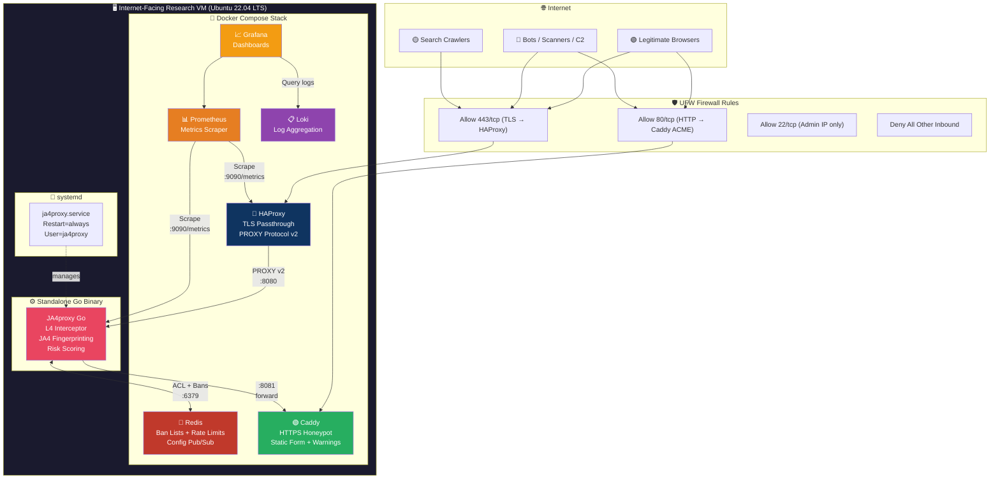
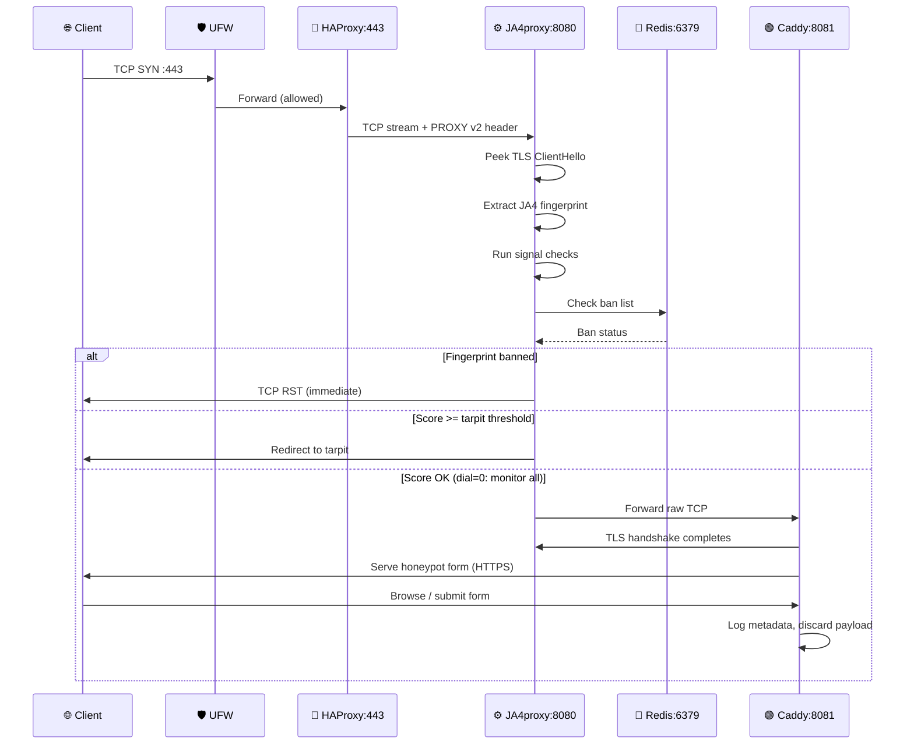
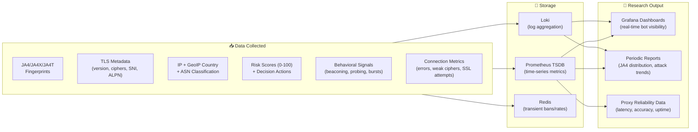
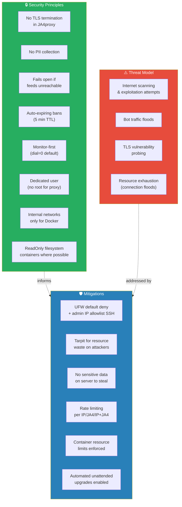

# Phase 0: Project Overview & Architecture

## Purpose

Deploy JA4proxy (Go production binary) on an independent, internet-facing Ubuntu 22.04 VM for **research purposes only** — collecting real-world bot/crawler attack data at the TLS layer and validating the reliability of the Go JA4proxy implementation.

This machine is **unattached to anything of importance**. It exists purely as a research honeypot behind a JA4 fingerprinting proxy.

---

## Design Decisions

| Decision | Rationale |
|----------|-----------|
| **No build tools on the server** | Internet-facing machine must have minimal attack surface. All artifacts are pre-built and transferred as deployable units only. |
| **Go binary for JA4proxy** | ~15,000+ conn/s, no GIL contention, production-grade. Cross-compiled locally, SCP'd to VM. |
| **Docker Compose for supporting services** | Official pre-built images from Docker Hub. No compilers, no build chains. Just `docker compose up`. |
| **No container registry** | We use only official Docker Hub images (HAProxy, Redis, Caddy, Prometheus, Grafana, Loki). The Go binary is transferred via SCP. |
| **Static HTML + Caddy for honeypot** | Caddy auto-manages HTTPS behind the TLS passthrough proxy. Zero-config, minimal moving parts. |
| **Dial = 0 at start** | Monitor-only mode. Log everything, block nothing. Escalate only after validating data quality. |
| **No external threat intel feeds initially** | Start with JA4 fingerprinting, GeoIP, ASN, and TCP signals. Add Spamhaus/AbuseIPDB later when baseline is solid. |

---

## Architecture Diagram

---

## Network Flow

---

## Component Inventory

| Component | Type | Source | Port (internal) | Port (host) | User |
|-----------|------|--------|-----------------|-------------|------|
| **JA4proxy Go** | Binary (cross-compiled) | Build locally, SCP | 8080 (proxy), 9090 (metrics) | 8080, 9090 | `ja4proxy` (dedicated) |
| **HAProxy** | Docker container | `haproxy:2.8-alpine` | 443, 8404 (stats) | 443, 8404 | root (container) |
| **Redis** | Docker container | `redis:7-alpine` | 6379 | none (internal network) | redis (container) |
| **Caddy** | Docker container | `caddy:2-alpine` | 8081 | none (internal network) | caddy (container) |
| **Prometheus** | Docker container | `prom/prometheus:latest` | 9090 | 9091 (host) | nobody (container) |
| **Grafana** | Docker container | `grafana/grafana:latest` | 3000 | 3000 (host) | grafana (container) |
| **Loki** | Docker container | `grafana/loki:latest` | 3100 | none (internal network) | loki (container) |
| **Promtail** | Docker container | `grafana/promtail:latest` | - | none | root (container) |

---

## Data Flow Summary

---

## What We Gather (Detailed)

### Per-Connection Data
- **JA4 fingerprint** — `t13d1517h2_...` style identifier derived from TLS ClientHello
- **JA4X fingerprint** — Extended fingerprint (X.509 certificate metadata if available)
- **JA4T fingerprint** — TCP-level fingerprint
- **Source IP** — client IP (extracted via PROXY protocol v2)
- **GeoIP country code** — via IP2Location LITE database
- **ASN classification** — datacenter, hosting provider, Tor exit node
- **TLS version** — attempted TLS version (SSLv3, TLS 1.0/1.1/1.2/1.3)
- **Cipher suites** — list of offered ciphers
- **Extensions** — TLS extensions present in ClientHello
- **ALPN** — Application-Layer Protocol Negotiation values (h2, h1, etc.)
- **SNI** — Server Name Indication hostname

### Decision & Scoring Data
- **Risk score** (0–100) — composite score from all signal modules
- **Action taken** — `allow`, `flag`, `rate_limit`, `tarpit`, `block`, `ban`
- **Block reason** — which rule triggered the decision
- **Dial setting** — current dial value at time of decision
- **Bypass matched** — which bypass rule applied (if any)

### Behavioral Signals
- **Beaconing detection** — periodic callback patterns (CV-based)
- **Probing detection** — scanning/enumeration behavior
- **Burst detection** — rapid connection bursts from same source
- **Connection lifespan** — how long connections stay open
- **Return visitor tracking** — repeat connections from same JA4+IP
- **TCP session analysis** — resumption patterns, TLS alerts

### Operational Metrics
- **Connection rates** — connections/second by IP, JA4, and IP+JA4 pair
- **Tarpit stats** — concurrent tarpitted connections, overflow events
- **Ban lifecycle** — ban creation, expiration (5-min TTL)
- **Config reloads** — hot-reload events via SIGHUP
- **Pipeline duration** — end-to-end processing latency (p50, p99)
- **Connection errors** — by type (timeout, reset, parse failure)

---

## Security Posture

---

## Phase Document Index

| Phase | Document | Status |
|-------|----------|--------|
| **Phase 0** | This document — overview, architecture, diagrams | ✅ This file |
| **Phase 1** | `PHASE_01_VM_PROVISIONING.md` — VM setup, hardening, firewall | ⏳ Next |
| **Phase 2** | `PHASE_02_ARTIFACT_PREPARATION.md` — build, config prep, transfer | ⏳ |
| **Phase 3** | `PHASE_03_JA4PROXY_DEPLOYMENT.md` — Go binary, systemd, monitor mode | ⏳ |
| **Phase 4** | `PHASE_04_SUPPORTING_SERVICES.md` — Docker Compose stack | ⏳ |
| **Phase 5** | `PHASE_05_DATA_COLLECTION.md` — research plan, dashboards, retention | ⏳ |
| **Phase 6** | `PHASE_06_OPERATIONAL_SECURITY.md` — access, alerting, incident response | ⏳ |
| **Phase 7** | `PHASE_07_VALIDATION_TESTING.md` — verification, traffic generation, dial escalation | ⏳ |
| **Phase 8** | `PHASE_08_SECURITY_HARDENING.md` — STRIDE threat model, kernel hardening, container security, forensics | ⏳ |

---

## Glossary

| Term | Definition |
|------|------------|
| **JA4** | JA4 fingerprinting — TLS ClientHello fingerprinting method by FoxIO |
| **JA4X** | Extended JA4 including X.509 certificate metadata |
| **JA4T** | TCP-level JA4 fingerprint |
| **Dial** | JA4proxy master control (0=monitor, 100=full block) |
| **Tarpit** | Slow TCP server that wastes attacker resources |
| **PROXY Protocol v2** | Header carrying original client IP through proxies |
| **Caddy** | Web server with automatic HTTPS (Let's Encrypt) |
| **Counterfactual** | "What would have happened if dial was higher?" — logged for analysis |
