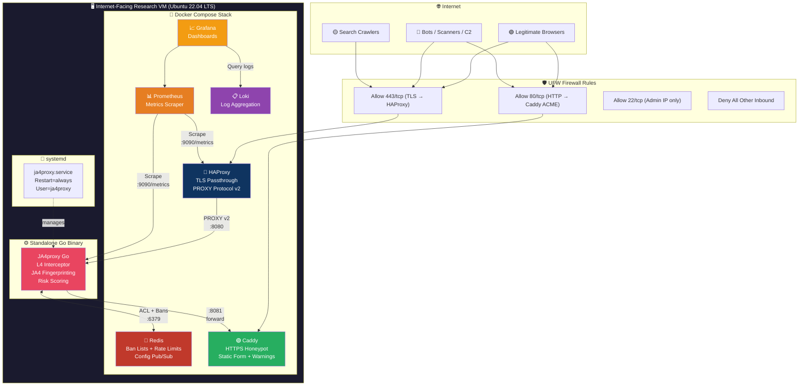
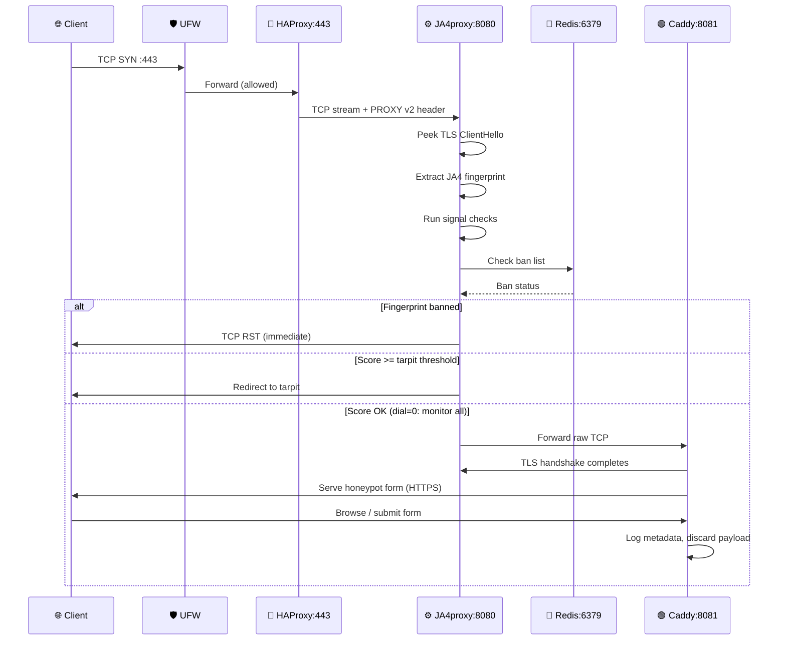
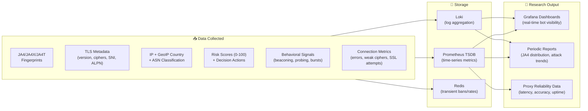
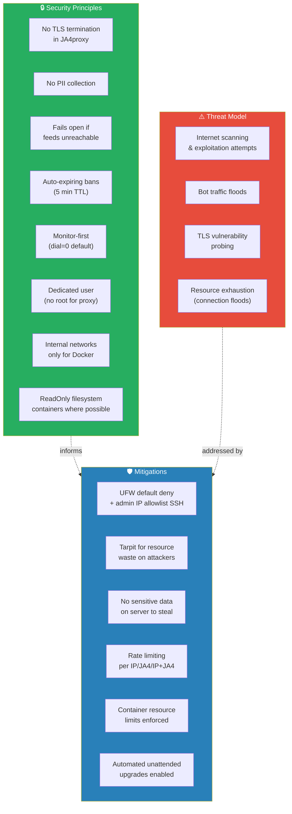

# Phase 0: Project Overview & Architecture

## Purpose

Deploy JA4proxy (Go production binary) on an independent, internet-facing Ubuntu 22.04 VM for **research purposes only** — collecting real-world bot/crawler attack data at the TLS layer and validating the reliability of the Go JA4proxy implementation.

This machine is **unattached to anything of importance**. It exists purely as a research honeypot behind a JA4 fingerprinting proxy.

---

## Design Decisions

The foundational design decisions for this system live as numbered,
append-only Architecture Decision Records under [`docs/adr/`](../adr/).
Start with [`docs/adr/README.md`](../adr/README.md) for the index.

The seven decisions that shaped the initial deployment are:

- [ADR 0001 — No build tools on the server](../adr/0001-no-build-tools-on-server.md)
- [ADR 0002 — Go binary for JA4proxy](../adr/0002-go-binary-for-ja4proxy.md)
- [ADR 0003 — Docker Compose for supporting services](../adr/0003-docker-compose-for-supporting-services.md)
- [ADR 0004 — No private container registry](../adr/0004-no-container-registry.md)
- [ADR 0005 — Static HTML plus Caddy for the honeypot](../adr/0005-static-html-and-caddy-for-honeypot.md)
- [ADR 0006 — Dial = 0 at initial deployment](../adr/0006-dial-zero-at-start.md)
- [ADR 0007 — No external threat-intel feeds initially](../adr/0007-no-external-threat-intel.md)

New design decisions go in a new ADR (`docs/adr/0008-*.md`, etc.),
not as edits to this table or to accepted ADRs — see the README for
the workflow.

---

## Architecture Diagram

---

## Network Flow

---

## Component Inventory

| Component | Type | Source | Port (internal) | Port (host) | User |
|-----------|------|--------|-----------------|-------------|------|
| **JA4proxy Go** | Binary (cross-compiled) | Build locally, SCP | 8080 (proxy), 9090 (metrics) | 8080, 9090 | `ja4proxy` (dedicated) |
| **HAProxy** | Docker container | `haproxy:2.8-alpine` | 443, 8404 (stats) | 443, 8404 | root (container) |
| **Redis** | Docker container | `redis:8-alpine` | 6379 | none (internal network) | redis (container) |
| **Caddy** | Docker container | `caddy:2-alpine` | 8081 | none (internal network) | caddy (container) |
| **Prometheus** | Docker container | `prom/prometheus:latest` | 9090 | 9091 (host) | nobody (container) |
| **Grafana** | Docker container | `grafana/grafana:latest` | 3000 | 3000 (host) | grafana (container) |
| **Loki** | Docker container | `grafana/loki:latest` | 3100 | none (internal network) | loki (container) |
| **Promtail** | Docker container | `grafana/promtail:latest` | - | none | root (container) |

---

## Data Flow Summary

---

## What We Gather (Detailed)

### Per-Connection Data
- **JA4 fingerprint** — `t13d1517h2_...` style identifier derived from TLS ClientHello
- **JA4X fingerprint** — Extended fingerprint (X.509 certificate metadata if available)
- **JA4T fingerprint** — TCP-level fingerprint
- **Source IP** — client IP (extracted via PROXY protocol v2)
- **GeoIP country code** — via IP2Location LITE database
- **ASN classification** — datacenter, hosting provider, Tor exit node
- **TLS version** — attempted TLS version (SSLv3, TLS 1.0/1.1/1.2/1.3)
- **Cipher suites** — list of offered ciphers
- **Extensions** — TLS extensions present in ClientHello
- **ALPN** — Application-Layer Protocol Negotiation values (h2, h1, etc.)
- **SNI** — Server Name Indication hostname

### Decision & Scoring Data
- **Risk score** (0–100) — composite score from all signal modules
- **Action taken** — `allow`, `flag`, `rate_limit`, `tarpit`, `block`, `ban`
- **Block reason** — which rule triggered the decision
- **Dial setting** — current dial value at time of decision
- **Bypass matched** — which bypass rule applied (if any)

### Behavioral Signals
- **Beaconing detection** — periodic callback patterns (CV-based)
- **Probing detection** — scanning/enumeration behavior
- **Burst detection** — rapid connection bursts from same source
- **Connection lifespan** — how long connections stay open
- **Return visitor tracking** — repeat connections from same JA4+IP
- **TCP session analysis** — resumption patterns, TLS alerts

### Operational Metrics
- **Connection rates** — connections/second by IP, JA4, and IP+JA4 pair
- **Tarpit stats** — concurrent tarpitted connections, overflow events
- **Ban lifecycle** — ban creation, expiration (5-min TTL)
- **Config reloads** — hot-reload events via SIGHUP
- **Pipeline duration** — end-to-end processing latency (p50, p99)
- **Connection errors** — by type (timeout, reset, parse failure)

---

## Security Posture

---

## Phase Document Index

| Phase | Document | Status |
|-------|----------|--------|
| **Phase 0** | This document — overview, architecture, diagrams | ✅ |
| **Phase 1** | `PHASE_01_VM_PROVISIONING.md` — VM setup, hardening, firewall | ✅ implemented (role 01) |
| **Phase 2** | `PHASE_02_ARTIFACT_PREPARATION.md` — build, config prep, transfer | ✅ implemented (role 02) |
| **Phase 3** | `PHASE_03_JA4PROXY_DEPLOYMENT.md` — Go binary, systemd, monitor mode | ⚠ implemented with caveats (role 03, see known-issues note in that doc) |
| **Phase 4** | `PHASE_04_SUPPORTING_SERVICES.md` — Docker Compose stack | ✅ implemented (role 04) |
| **Phase 5** | `PHASE_05_DATA_COLLECTION.md` — research plan, dashboards, retention | ⚠ retention enforcement is aspirational, see PHASE_12 |
| **Phase 6** | `PHASE_06_OPERATIONAL_SECURITY.md` — access, alerting, incident response | ⚠ alerting is only *dashboarded*, not delivered — see PHASE_13 |
| **Phase 7** | `PHASE_07_VALIDATION_TESTING.md` — verification, traffic generation, dial escalation | ✅ implemented (role 07 + `verify-local.sh`) |
| **Phase 8** | `PHASE_08_SECURITY_HARDENING.md` — STRIDE, kernel, container | ⚠ implemented with AppArmor-ordering bug, see known-issues note |
| **Phase 9** | `PHASE_09_IMAGE_DIGESTS.md` — Docker image digest pinning | ⚠ implemented with regex bug, see that doc |
| **Phase 10** | `PHASE_10_GO_LIVE.md` — public exposure transition | ✅ implemented (role 10); needs DNS + legal preconditions from PHASE_11/13 |
| **Phase 11** | `PHASE_11_LEGAL_ETHICS_AND_HONEYPOT_DISCLOSURE.md` | ❌ not implemented — **blocks go-live** |
| **Phase 12** | `PHASE_12_DATA_LIFECYCLE_AND_EXPORT.md` | ❌ not implemented |
| **Phase 13** | `PHASE_13_POST_LAUNCH_OPERATIONS.md` — alerting, cert, DNS preflight, rotation | ❌ not implemented |
| **Phase 14** | `PHASE_14_CI_AND_IDEMPOTENCY.md` — Ansible test harness | ❌ not implemented |
| **Phase 15** | `PHASE_15_ABUSE_AND_INCIDENT_RESPONSE.md` — abuse queue, IR playbooks | ❌ not implemented |
| **Phase 16** | `PHASE_16_LINT_COVERAGE.md` — lint to 100% across file types | ✅ |
| **Phase 17** | `PHASE_17_CI_HARDENING.md` — CI bug fixes + new offline checks | ✅ |
| **Phase 18** | `PHASE_18_SWEBOK_GAP_CLOSURE.md` — SBOM, SLSA, Scorecard, ADRs, SSDF mapping | ⏳ in progress |
| **Phase 19** | `PHASE_19_PENTEST_CAMPAIGN.md` — full pre-go-live penetration test | ❌ not implemented |
| **Review** | `CRITICAL_REVIEW.md` — expert pass, 2026-04-15 | ✅ |

---

## Glossary

| Term | Definition |
|------|------------|
| **JA4** | JA4 fingerprinting — TLS ClientHello fingerprinting method by FoxIO |
| **JA4X** | Extended JA4 including X.509 certificate metadata |
| **JA4T** | TCP-level JA4 fingerprint |
| **Dial** | JA4proxy master control (0=monitor, 100=full block) |
| **Tarpit** | Slow TCP server that wastes attacker resources |
| **PROXY Protocol v2** | Header carrying original client IP through proxies |
| **Caddy** | Web server with automatic HTTPS (Let's Encrypt) |
| **Counterfactual** | "What would have happened if dial was higher?" — logged for analysis |
