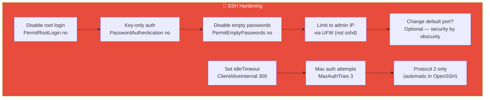
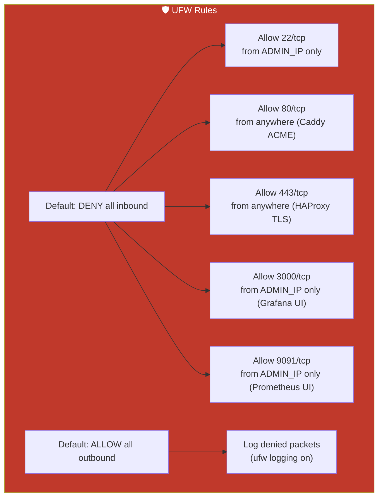

# Phase 1: VM Provisioning & Hardening

## Objective

Provision a clean Ubuntu 22.04 LTS VM and harden it for internet-facing research use. This machine has **no connection to production systems** and exists purely for JA4proxy research data collection.

---

## 1.1 VM Requirements

```mermaid
flowchart LR
    subgraph Specs["📋 Minimum Specifications"]
        CPU["2 vCPU\n(4 recommended)"]
        RAM["4 GB RAM\n(8 recommended)"]
        DISK["20 GB SSD\n(50 for extended logging)"]
        NET["Public IP\n+ Domain/Subdomain"]
    end

    subgraph OS["🐧 OS: Ubuntu 22.04 LTS"]
        MINIMAL["Minimal install\n(no GUI, no extras)"]
        UPDATES["Automated security\nupdates enabled"]
        KERNEL["Latest HWE\nkernel"]
    end

    subgraph Network["🌐 Network"]
        DOMAIN["dedicated test domain\ne.g. test.example.com"]
        DNS_A["A record → VM IP"]
        DNS_TXT["TXT record with\ncontact info + purpose"]
        PTR["Reverse DNS\n(PTR) record set"]
    end

    Specs --> OS
    OS --> Network

    style Specs fill:#2980b9,color:#fff
    style OS fill:#27ae60,color:#fff
    style Network fill:#8e44ad,color:#fff
```



### Required Specifications

| Resource | Minimum | Recommended |
|----------|---------|-------------|
| CPU | 2 vCPU | 4 vCPU (high traffic) |
| RAM | 4 GB | 8 GB |
| Storage | 20 GB SSD | 50 GB SSD (extended logs) |
| Network | 1 public IP | + dedicated domain |
| OS | Ubuntu 22.04 LTS (minimal) | Same |

### Domain Configuration

Register a **dedicated test domain** that clearly communicates this is a research/test system:

- **Domain suggestion**: `test-dont-submit.example.com` or `research-honeypot.example.com`
- **DNS A record**: points to VM public IP
- **DNS TXT record**: `"This is a research honeypot. Do not submit real data. Contact: admin@example.com"`
- **Reverse DNS (PTR)**: set to match the domain name

---

## 1.2 Initial System Setup

### Step 1: System Update & Base Packages

```bash
# Update everything
sudo apt update && sudo apt upgrade -y

# Install essential packages
sudo apt install -y \
    ufw \
    fail2ban \
    unattended-upgrades \
    apt-listchanges \
    curl \
    git \
    jq \
    htop \
    vim-tiny \
    net-tools \
    dnsutils \
    lsb-release \
    ca-certificates \
    gnupg \
    software-properties-common
```

### Step 2: Automated Security Updates

```bash
# Enable unattended-upgrades
sudo dpkg-reconfigure -plow unattended-upgrades

# Configure automatic reboot after updates (disable for a server)
sudo systemctl mask systemd-update-reboot.service
```

### Step 3: Create Dedicated System Users

```bash
# JA4proxy service user — no login, no home directory
sudo useradd --system --no-create-home --shell /usr/sbin/nologin ja4proxy

# Admin user for SSH access (replace with your username)
sudo useradd --create-home --shell /bin/bash adminuser
sudo usermod -aG sudo adminuser
```

---

## 1.3 SSH Hardening



Edit `/etc/ssh/sshd_config`:

```bash
sudo cp /etc/ssh/sshd_config /etc/ssh/sshd_config.bak

# Apply hardening via sed (or edit manually)
sudo sed -i 's/^#*PermitRootLogin.*/PermitRootLogin no/' /etc/ssh/sshd_config
sudo sed -i 's/^#*PasswordAuthentication.*/PasswordAuthentication no/' /etc/ssh/sshd_config
sudo sed -i 's/^#*PermitEmptyPasswords.*/PermitEmptyPasswords no/' /etc/ssh/sshd_config
sudo sed -i 's/^#*MaxAuthTries.*/MaxAuthTries 3/' /etc/ssh/sshd_config
sudo sed -i 's/^#*ClientAliveInterval.*/ClientAliveInterval 300/' /etc/ssh/sshd_config
sudo sed -i 's/^#*ClientAliveCountMax.*/ClientAliveCountMax 2/' /etc/ssh/sshd_config
sudo sed -i 's/^#*X11Forwarding.*/X11Forwarding no/' /etc/ssh/sshd_config

# Restart SSH
sudo systemctl restart sshd
```

**Before disabling password auth**, ensure your SSH key is already in `~/.ssh/authorized_keys`.

---

## 1.4 Firewall (UFW)



```bash
# Reset any existing rules
sudo ufw --force reset

# Set defaults
sudo ufw default deny incoming
sudo ufw default allow outgoing

# SSH — restrict to admin IP (replace with your actual admin IP)
sudo ufw allow from <ADMIN_IP> to any port 22 proto tcp comment "SSH admin only"

# HTTP — needed for Caddy ACME challenges
sudo ufw allow 80/tcp comment "Caddy ACME HTTP"

# HTTPS — main entry point for HAProxy
sudo ufw allow 443/tcp comment "HAProxy TLS passthrough"

# Grafana UI — admin IP only
sudo ufw allow from <ADMIN_IP> to any port 3000 proto tcp comment "Grafana dashboard"

# Prometheus UI — admin IP only (optional, can tunnel via SSH instead)
sudo ufw allow from <ADMIN_IP> to any port 9091 proto tcp comment "Prometheus UI"

# Enable logging
sudo ufw logging on

# Enable firewall
sudo ufw --force enable

# Verify
sudo ufw status verbose
```

---

## 1.5 Fail2ban

```bash
sudo cat > /etc/fail2ban/jail.local << 'EOF'
[DEFAULT]
bantime = 3600
findtime = 600
maxretry = 3
banaction = ufw

[sshd]
enabled = true
port = ssh
filter = sshd
logpath = /var/log/auth.log
maxretry = 3
bantime = 7200
EOF

sudo systemctl enable fail2ban
sudo systemctl restart fail2ban
```

---

## 1.6 Docker Installation

```bash
# Install Docker from official repo
sudo install -m 0755 -d /etc/apt/keyrings
curl -fsSL https://download.docker.com/linux/ubuntu/gpg | sudo gpg --dearmor -o /etc/apt/keyrings/docker.gpg
sudo chmod a+r /etc/apt/keyrings/docker.gpg

echo \
  "deb [arch=$(dpkg --print-architecture) signed-by=/etc/apt/keyrings/docker.gpg] https://download.docker.com/linux/ubuntu \
  $(lsb_release -cs) stable" | sudo tee /etc/apt/sources.list.d/docker.list > /dev/null

sudo apt update
sudo apt install -y docker-ce docker-ce-cli containerd.io docker-compose-plugin

# Add admin user to docker group (optional — consider using sudo docker instead)
sudo usermod -aG docker adminuser

# Verify
docker --version
docker compose version
```

### Docker Security Hardening

```bash
# Ensure Docker daemon doesn't expose ports on all interfaces unnecessarily
sudo cat > /etc/docker/daemon.json << 'EOF'
{
  "icc": false,
  "log-driver": "json-file",
  "log-opts": {
    "max-size": "100m",
    "max-file": "3"
  },
  "no-new-privileges": true,
  "userns-remap": "default"
}
EOF

# Set up user namespace remapping
sudo useradd --system dockremap

sudo systemctl restart docker
```

---

## 1.7 Directory Structure Setup

```bash
# Create application directories
sudo mkdir -p /opt/ja4proxy/{bin,config,logs,geoip}
sudo mkdir -p /opt/ja4proxy-docker/{config,caddy-data,prometheus-data,loki-data,grafana-data}

# Set ownership
sudo chown -R ja4proxy:ja4proxy /opt/ja4proxy
sudo chown -R adminuser:adminuser /opt/ja4proxy-docker

# Create config directories
sudo mkdir -p /opt/ja4proxy-docker/config/{haproxy,prometheus,grafana,loki,promtail}
```

---

## 1.8 System Limits

```bash
# Increase file descriptor limits for high connection rates
sudo cat >> /etc/security/limits.conf << 'EOF'
ja4proxy    soft    nofile    65536
ja4proxy    hard    nofile    65536
*           soft    nofile    32768
*           hard    nofile    32768
EOF

# Increase conntrack table for high connection volumes
# Note: nf_conntrack module must be loaded first (usually loaded by UFW automatically)
sudo modprobe nf_conntrack 2>/dev/null || true
sudo sysctl -w net.netfilter.nf_conntrack_max=262144 2>/dev/null || echo "⚠️ conntrack sysctl skipped (module not loaded — will apply after UFW enables nf_conntrack)"
echo 'net.netfilter.nf_conntrack_max=262144' | sudo tee /etc/sysctl.d/99-conntrack.conf

# Apply sysctl changes
sudo sysctl -p

# Enable IP forwarding (needed for Docker networking)
sudo sed -i 's/^#*net.ipv4.ip_forward=0/net.ipv4.ip_forward=1/' /etc/sysctl.conf
sudo sysctl -w net.ipv4.ip_forward=1
```

---

## 1.9 Verification Checklist

```mermaid
flowchart LR
    subgraph Checks["✅ Phase 1 Verification"]
        C1["✅ OS is Ubuntu 22.04 LTS minimal"]
        C2["✅ All packages updated"]
        C3["✅ SSH: root login disabled, keys only"]
        C4["✅ UFW: default deny, only 80/443 open"]
        C5["✅ Fail2ban active for SSH"]
        C6["✅ Docker installed + daemon hardened"]
        C7["✅ Directory structure created"]
        C8["✅ Dedicated ja4proxy user exists"]
        C9["✅ Auto security updates enabled"]
        C10["✅ DNS records configured"]
    end

    style Checks fill:#27ae60,color:#fff
```



Run these checks:

```bash
# OS version
lsb_release -a

# SSH config
sshd -T | grep -E "permitrootlogin|passwordauthentication|permitemptypasswords|maxauthtries"

# Firewall
sudo ufw status verbose

# Docker
docker info --format '{{.SecurityOptions}}'

# User
id ja4proxy

# Auto updates
systemctl status unattended-upgrades
```

---

## Dependencies

- **Phase 0**: Architecture decisions inform this phase (Ubuntu 22.04, dedicated user, no root)
- **→ Phase 2**: Ready to receive artifacts (binary + configs) into `/opt/ja4proxy/`
- **→ Phase 4**: Docker ready for `docker compose up`

---

## Notes & Decisions

| Decision | Rationale |
|----------|-----------|
| No TLS on internal Docker networks initially | Adds complexity; internal Docker networks are already isolated. Can add later. |
| Prometheus/Grafana ports admin-only | No need to expose dashboards to the internet. SSH tunnel instead. |
| User namespace remapping | Extra Docker isolation layer — containers can't map to host root. |
| 65536 file descriptors for ja4proxy | High connection rate environments need many simultaneous FDs. |
| Conditional conntrack sysctl | nf_conntrack module may not be loaded until UFW activates it. Graceful fallback avoids errors. |
