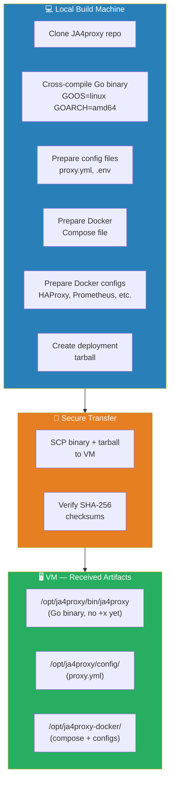

# Phase 2: Artifact Preparation & Transfer

## Objective

Build, package, and securely transfer all deployment artifacts to the hardened VM. **No build tools, compilers, or source code ever touch the internet-facing server.**

---

## 2.1 Artifact Inventory



| Artifact | Type | Built On | Transfer Method | Destination |
|----------|------|----------|-----------------|-------------|
| JA4proxy Go binary | Static binary | Local machine (cross-compile) | SCP | `/opt/ja4proxy/bin/ja4proxy` |
| `proxy.yml` | YAML config | Local machine | SCP (inside tarball) | `/opt/ja4proxy/config/proxy.yml` |
| `.env` | Environment vars | Local machine (generated) | SCP (inside tarball) | `/opt/ja4proxy-docker/.env` |
| `docker-compose.yml` | Docker Compose | Local machine | SCP (inside tarball) | `/opt/ja4proxy-docker/docker-compose.yml` |
| HAProxy config | CFG | Local machine | SCP (inside tarball) | `/opt/ja4proxy-docker/config/haproxy/haproxy.cfg` |
| Prometheus config | YAML | Local machine | SCP (inside tarball) | `/opt/ja4proxy-docker/config/prometheus/prometheus.yml` |
| Grafana provisioning | YAML + JSON | Local machine | SCP (inside tarball) | `/opt/ja4proxy-docker/config/grafana/` |
| Loki config | YAML | Local machine | SCP (inside tarball) | `/opt/ja4proxy-docker/config/loki/loki.yml` |
| Promtail config | YAML | Local machine | SCP (inside tarball) | `/opt/ja4proxy-docker/config/promtail/promtail.yml` |
| GeoIP database | DAT file | Downloaded on VM | Direct download | `/opt/ja4proxy/geoip/` |
| TLS certificate | PEM | Caddy (auto-generated) | N/A | Caddy handles internally |

---

## 2.2 Build the Go Binary (Local Machine)

```bash
# Clone the JA4proxy repository
git clone https://github.com/seanpor/JA4proxy.git
cd JA4proxy

# Check out the specific commit/version you want to test
git log --oneline -5  # find the right commit

# Cross-compile for the target VM (Linux amd64)
GOOS=linux GOARCH=amd64 CGO_ENABLED=0 make go-build

# Verify the binary
file bin/proxy
# Expected: ELF 64-bit LSB executable, x86-64, statically linked

# Generate SHA-256 checksum for verification
sha256sum bin/proxy > bin/proxy.sha256

# The binary is now ready at bin/proxy
```

### Build Verification

```bash
# Verify it's a static binary (no dynamic library dependencies)
ldd bin/proxy
# Expected: "not a dynamic executable"

# Check file size (should be 15-30MB for a Go binary)
ls -lh bin/proxy

# Run help/version if available
./bin/proxy --version 2>/dev/null || echo "No version flag, binary built successfully"
```

---

## 2.3 Prepare Configuration Files

### 2.3.1 `proxy.yml` — JA4proxy Configuration

Create a **research-optimized** config at `config/proxy.yml` on your local machine:

```yaml
# JA4proxy Configuration — Research Honeypot
# Dial = 0 (monitor only). No blocking. Log everything.

proxy:
  mode: passthrough
  bind_host: "127.0.0.1"
  bind_port: 8080
  backend_host: "127.0.0.1"
  backend_port: 8081        # Caddy (honeypot) via Docker internal network
  connection_timeout_ms: 5000
  drain_timeout_seconds: 30

redis:
  host: "127.0.0.1"
  port: 6379
  db: 0
  timeout: 2

security:
  # Research mode: no hard blocks, just logging
  whitelist: []
  blacklist: []
  whitelist_patterns: []
  multi_strategy_policy: "any"

  rate_limit_strategies:
    by_ip:
      enabled: false          # Disabled in monitor mode
      thresholds:
        suspicious: 20
        block: 50
        ban: 100
      action: "block"
      ban_duration: 300
    by_ja4:
      enabled: false
      thresholds:
        suspicious: 20
        block: 50
        ban: 100
      action: "block"
      ban_duration: 300
    by_ip_ja4_pair:
      enabled: false
      thresholds:
        suspicious: 20
        block: 50
        ban: 100
      action: "block"
      ban_duration: 300

geoip:
  country_database_path: "/opt/ja4proxy/geoip/IP2LOCATION-LITE-DB1.IPV6.BIN"
  country_whitelist_enabled: false
  country_blacklist_enabled: false

metrics:
  port: 9090
  bind_host: "0.0.0.0"      # Allow Prometheus to scrape

logging:
  level: "debug"            # Maximum verbosity for research
  format: "legacy"
  dual_output: true

tarpit:
  max_concurrent_connections: 500
  max_per_ip: 3
  overflow_action: "block"
  worker_count: 10

monitor_mode:
  dial: 0                   # MONITOR ONLY — never block
  blocking_acknowledged: false
  counterfactuals: true     # Log "what would have happened"

# All bypasses and signal modules enabled for maximum data collection
security_policy:
  alpn_browser_bypass_enabled: true
  ja4_whitelist_bypass_enabled: true
  mtls_bypass_enabled: false
  static_ip_allowlist_enabled: false
  ja4_blacklist_bypass_enabled: false
  country_blacklist_bypass_enabled: false
  spamhaus_bypass_enabled: false    # No external feeds initially
  tls_version_bypass_enabled: true

risk_scorer:
  flag: 20
  rate_limit: 35
  tarpit: 55
  block: 70
  ban: 85

# Threat intel — all disabled for initial deployment
abuseipdb:
  enabled: false

blocklists:
  spamhaus:
    enabled: false

beaconing_detector:
  enabled: true             # Detect periodic callbacks
  cv_threshold: 0.8
  max_suspects: 10000

dns_enrichment:
  enabled: false

asn_classifier:
  enabled: true
  datacenter_list_path: ""
  tor_exit_list_path: ""

tcp_analyzer:
  fingerprinting_enabled: true
  session_resumption_tracking: true
  connection_lifespan_tracking: true
  concurrent_connection_tracking: true
  return_visitor_tracking: true
  tls_alert_tracking: true

fingerprinting:
  ja4x_enabled: true
  ja4t_enabled: true
  blacklist_score: 0
```

### 2.3.2 `.env` — Docker Compose Environment

Generate this file with random passwords:

```bash
# Generate on local machine
REDIS_PASSWORD=$(openssl rand -base64 32)
GRAFANA_PASSWORD=$(openssl rand -base64 32)
REDIS_SIGNING_KEY=$(openssl rand -hex 32)
GRAFANA_ADMIN_PASSWORD=$(openssl rand -base64 32)

cat > .env << EOF
# JA4proxy Research Honeypot — Docker Environment
# Generated: $(date -u +%Y-%m-%dT%H:%M:%SZ)

BACKEND_HOST=127.0.0.1
BACKEND_PORT=8081

REDIS_PASSWORD=${REDIS_PASSWORD}
GRAFANA_ADMIN_PASSWORD=${GRAFANA_ADMIN_PASSWORD}
GRAFANA_PASSWORD=${GRAFANA_PASSWORD}
REDIS_SIGNING_KEY=${REDIS_SIGNING_KEY}

ENVIRONMENT=production
LOG_LEVEL=info

# Port overrides (host-facing)
HAPROXY_TLS_PORT=443
HAPROXY_HTTP_PORT=80
HAPROXY_STATS_PORT=8404
PROXY_METRICS_PORT=9090
PROMETHEUS_PORT=9091
GRAFANA_PORT=3000

# Threat intel — disabled initially
JA4DB_API_KEY=
ABUSEIPDB_API_KEY=

# Admin IP for binding (restrict management UIs)
AGENT_BIND_IP=127.0.0.1
EOF
```

### 2.3.3 HAProxy Configuration

```haproxy
# HAProxy — TLS Passthrough for JA4proxy Research
# Listens on :443, passes raw TCP to JA4proxy on :8080

global
    maxconn 10000
    log stdout format raw local0
    ssl-default-bind-options ssl-min-ver TLSv1.2 no-tls-tickets
    ssl-default-bind-ciphers ECDHE-ECDSA-AES256-GCM-SHA384:ECDHE-RSA-AES256-GCM-SHA384:ECDHE-ECDSA-CHACHA20-POLY1305:ECDHE-RSA-CHACHA20-POLY1305
    stats socket /var/run/haproxy.sock mode 660 level admin

defaults
    log     global
    mode    tcp
    option  tcplog
    option  dontlognull
    timeout connect 5s
    timeout client  30s
    timeout server  30s
    retries 3

# Stats page (internal only)
frontend stats
    bind *:8404
    mode http
    stats enable
    stats uri /stats
    stats refresh 10s
    stats auth admin:${HAPROXY_STATS_PASSWORD}

# Main TLS entry point
frontend tls_in
    bind *:443
    mode tcp
    option tcplog
    default_backend ja4proxy_workers

backend ja4proxy_workers
    mode tcp
    balance roundrobin
    option tcp-check
    # Health check via JA4proxy /health endpoint on metrics port
    server ja4proxy 127.0.0.1:8080 check inter 5s fall 3 rise 2
```

### 2.3.4 Docker Compose File

```yaml
# docker-compose.yml — JA4proxy Research Honeypot
# Supporting services only. JA4proxy runs as standalone binary.
# Note: No 'version:' key needed — Docker Compose v2 ignores it.

networks:
  ja4proxy-frontend:
    driver: bridge
  ja4proxy-internal:
    driver: bridge
    internal: true          # No outbound internet access
  ja4proxy-monitoring:
    driver: bridge
    internal: true

volumes:
  redis-data:
  prometheus-data:
  loki-data:
  grafana-data:
  caddy-data:
  caddy-config:

services:
  # ── HAProxy: TLS Passthrough ──
  haproxy:
    image: haproxy:2.8-alpine
    container_name: ja4proxy-haproxy
    restart: unless-stopped
    ports:
      - "443:443"
      - "80:80"
      - "8404:8404"
    volumes:
      - ./config/haproxy/haproxy.cfg:/usr/local/etc/haproxy/haproxy.cfg:ro
    networks:
      - ja4proxy-frontend
    deploy:
      resources:
        limits:
          memory: 256M
          cpus: "0.5"
    logging:
      driver: json-file
      options:
        max-size: "50m"
        max-file: "3"

  # ── Redis: State Store ──
  redis:
    image: redis:8-alpine
    container_name: ja4proxy-redis
    restart: unless-stopped
    command: >
      redis-server
      --requirepass ${REDIS_PASSWORD}
      --maxmemory 256mb
      --maxmemory-policy allkeys-lru
    volumes:
      - redis-data:/data
    networks:
      - ja4proxy-internal
    deploy:
      resources:
        limits:
          memory: 256M
          cpus: "0.25"
    logging:
      driver: json-file
      options:
        max-size: "10m"
        max-file: "3"

  # ── Caddy: Honeypot Backend ──
  caddy:
    image: caddy:2-alpine
    container_name: ja4proxy-honeypot
    restart: unless-stopped
    ports:
      - "8081:8081"
    volumes:
      - ./config/caddy/Caddyfile:/etc/caddy/Caddyfile:ro
      - ./config/caddy/html:/srv:ro
      - caddy-data:/data
      - caddy-config:/config
    networks:
      - ja4proxy-internal
    deploy:
      resources:
        limits:
          memory: 128M
          cpus: "0.25"
    logging:
      driver: json-file
      options:
        max-size: "50m"
        max-file: "3"

  # ── Prometheus: Metrics ──
  prometheus:
    image: prom/prometheus:latest
    container_name: ja4proxy-prometheus
    restart: unless-stopped
    command:
      - '--config.file=/etc/prometheus/prometheus.yml'
      - '--storage.tsdb.path=/prometheus'
      - '--storage.tsdb.retention.time=90d'
      - '--web.listen-address=:9090'
    ports:
      - "9091:9090"
    volumes:
      - ./config/prometheus/prometheus.yml:/etc/prometheus/prometheus.yml:ro
      - prometheus-data:/prometheus
    networks:
      - ja4proxy-monitoring
    deploy:
      resources:
        limits:
          memory: 512M
          cpus: "0.5"
    logging:
      driver: json-file
      options:
        max-size: "50m"
        max-file: "3"

  # ── Grafana: Dashboards ──
  grafana:
    image: grafana/grafana:latest
    container_name: ja4proxy-grafana
    restart: unless-stopped
    environment:
      - GF_SECURITY_ADMIN_PASSWORD=${GRAFANA_ADMIN_PASSWORD}
      - GF_SERVER_HTTP_PORT=3000
      - GF_AUTH_ANONYMOUS_ENABLED=false
    ports:
      - "3000:3000"
    volumes:
      - grafana-data:/var/lib/grafana
      - ./config/grafana/provisioning:/etc/grafana/provisioning:ro
    networks:
      - ja4proxy-monitoring
      - ja4proxy-frontend
    deploy:
      resources:
        limits:
          memory: 256M
          cpus: "0.5"
    logging:
      driver: json-file
      options:
        max-size: "50m"
        max-file: "3"

  # ── Loki: Log Aggregation ──
  loki:
    image: grafana/loki:latest
    container_name: ja4proxy-loki
    restart: unless-stopped
    command: -config.file=/etc/loki/loki.yml
    volumes:
      - loki-data:/loki
      - ./config/loki/loki.yml:/etc/loki/loki.yml:ro
    networks:
      - ja4proxy-monitoring
    deploy:
      resources:
        limits:
          memory: 256M
          cpus: "0.25"
    logging:
      driver: json-file
      options:
        max-size: "50m"
        max-file: "3"

  # ── Promtail: Log Shipper ──
  promtail:
    image: grafana/promtail:latest
    container_name: ja4proxy-promtail
    restart: unless-stopped
    volumes:
      - ./config/promtail/promtail.yml:/etc/promtail/promtail.yml:ro
      - /var/log:/var/log:ro
      - /opt/ja4proxy/logs:/opt/ja4proxy/logs:ro
    networks:
      - ja4proxy-monitoring
    command: -config.file=/etc/promtail/promtail.yml
    deploy:
      resources:
        limits:
          memory: 128M
          cpus: "0.25"
    logging:
      driver: json-file
      options:
        max-size: "10m"
        max-file: "3"
```

---

## 2.4 Package & Transfer

### Step 1: Create Deployment Tarball

```bash
# On your local machine, inside the JA4proxy repo or a staging directory:
DEPLOY_DIR="ja4proxy-deploy-$(date +%Y%m%d)"
mkdir -p "$DEPLOY_DIR"

# Copy the Go binary
cp bin/proxy "$DEPLOY_DIR/ja4proxy"
cp bin/proxy.sha256 "$DEPLOY_DIR/"

# Copy configs
mkdir -p "$DEPLOY_DIR/config"
cp config/proxy.yml "$DEPLOY_DIR/config/"
cp .env "$DEPLOY_DIR/"
cp docker/docker-compose.yml "$DEPLOY_DIR/docker-compose.yml"
cp -r config/haproxy/ "$DEPLOY_DIR/config/"
cp -r config/prometheus/ "$DEPLOY_DIR/config/"
cp -r config/grafana/ "$DEPLOY_DIR/config/"
cp -r config/loki/ "$DEPLOY_DIR/config/"
cp -r config/promtail/ "$DEPLOY_DIR/config/"
cp -r config/caddy/ "$DEPLOY_DIR/config/"

# Create tarball
tar czf "$DEPLOY_DIR.tar.gz" "$DEPLOY_DIR"

# Generate checksum
sha256sum "$DEPLOY_DIR.tar.gz" > "$DEPLOY_DIR.tar.gz.sha256"
```

### Step 2: SCP to VM

```bash
# Transfer tarball
scp "$DEPLOY_DIR.tar.gz" adminuser@<VM_IP>:/home/adminuser/
scp "$DEPLOY_DIR.tar.gz.sha256" adminuser@<VM_IP>:/home/adminuser/

# SSH into VM
ssh adminuser@<VM_IP>

# Verify checksum
cd /home/adminuser
sha256sum -c "$DEPLOY_DIR.tar.gz.sha256"
# Expected: OK

# Extract to deployment locations
tar xzf "$DEPLOY_DIR.tar.gz"

# Copy binary
sudo cp "$DEPLOY_DIR/ja4proxy" /opt/ja4proxy/bin/ja4proxy
sudo chown ja4proxy:ja4proxy /opt/ja4proxy/bin/ja4proxy
sudo chmod 750 /opt/ja4proxy/bin/ja4proxy

# Copy config
sudo cp "$DEPLOY_DIR/config/proxy.yml" /opt/ja4proxy/config/proxy.yml
sudo chown ja4proxy:ja4proxy /opt/ja4proxy/config/proxy.yml
sudo chmod 640 /opt/ja4proxy/config/proxy.yml

# Copy Docker compose + configs
sudo cp "$DEPLOY_DIR/docker-compose.yml" /opt/ja4proxy-docker/
sudo cp "$DEPLOY_DIR/.env" /opt/ja4proxy-docker/.env
sudo cp -r "$DEPLOY_DIR/config/haproxy"/* /opt/ja4proxy-docker/config/haproxy/
sudo cp -r "$DEPLOY_DIR/config/prometheus"/* /opt/ja4proxy-docker/config/prometheus/
sudo cp -r "$DEPLOY_DIR/config/grafana"/* /opt/ja4proxy-docker/config/grafana/
sudo cp -r "$DEPLOY_DIR/config/loki"/* /opt/ja4proxy-docker/config/loki/
sudo cp -r "$DEPLOY_DIR/config/promtail"/* /opt/ja4proxy-docker/config/promtail/
sudo cp -r "$DEPLOY_DIR/config/caddy"/* /opt/ja4proxy-docker/config/caddy/

# Clean up tarball
rm -rf "$DEPLOY_DIR" "$DEPLOY_DIR.tar.gz" "$DEPLOY_DIR.tar.gz.sha256"
```

---

## 2.5 Caddy Honeypot Content

Create the honeypot HTML at `/opt/ja4proxy-docker/config/caddy/html/index.html`:

```html
<!DOCTYPE html>
<html lang="en">
<head>
    <meta charset="UTF-8">
    <meta name="viewport" content="width=device-width, initial-scale=1.0">
    <title>⚠️ RESEARCH HONEYPOT — DO NOT SUBMIT REAL DATA</title>
    <style>
        * { margin: 0; padding: 0; box-sizing: border-box; }
        body {
            font-family: monospace;
            background: #0a0a0a;
            color: #ff4444;
            min-height: 100vh;
            display: flex;
            flex-direction: column;
            align-items: center;
            justify-content: center;
        }
        .warning {
            background: #ff0000;
            color: #ffffff;
            padding: 40px;
            text-align: center;
            font-size: 28px;
            font-weight: bold;
            width: 100%;
            border-bottom: 4px solid #cc0000;
        }
        .warning small {
            display: block;
            font-size: 16px;
            margin-top: 10px;
            font-weight: normal;
        }
        .content {
            max-width: 600px;
            padding: 40px 20px;
            text-align: center;
        }
        .content h2 {
            font-size: 20px;
            color: #ffaa00;
            margin-bottom: 20px;
        }
        .content p {
            font-size: 14px;
            color: #888;
            margin-bottom: 15px;
            line-height: 1.6;
        }
        .form-box {
            background: #1a1a1a;
            border: 2px solid #ff4444;
            padding: 30px;
            margin-top: 30px;
            border-radius: 8px;
        }
        .form-box input, .form-box textarea {
            width: 100%;
            padding: 10px;
            margin: 8px 0;
            background: #0a0a0a;
            border: 1px solid #444;
            color: #888;
            font-size: 14px;
            font-family: monospace;
        }
        .form-box button {
            background: #ff4444;
            color: white;
            border: none;
            padding: 12px 30px;
            font-size: 16px;
            cursor: pointer;
            margin-top: 15px;
        }
        .form-box button:hover {
            background: #cc0000;
        }
        .meta {
            font-size: 11px;
            color: #555;
            margin-top: 20px;
        }
    </style>
</head>
<body>
    <div class="warning">
        ⚠️ THIS IS A RESEARCH HONEYPOT ⚠️
        <small>No real data is collected. Any submissions are logged and discarded.
        If you are a legitimate user, you are in the wrong place.</small>
    </div>
    <div class="content">
        <h2>🔬 JA4proxy Research Environment</h2>
        <p>This server exists solely for TLS fingerprinting research.</p>
        <p>Your connection has been fingerprinted (JA4). Metadata including
        IP address, TLS parameters, and behavioral patterns are being logged
        for research analysis only.</p>

        <div class="form-box">
            <form method="POST" action="/submit">
                <input type="text" name="name" placeholder="Name (FAKE DATA ONLY)" autocomplete="off">
                <input type="email" name="email" placeholder="Email (FAKE DATA ONLY)" autocomplete="off">
                <textarea name="message" rows="4" placeholder="Message (FAKE DATA ONLY — do NOT submit real info)"></textarea>
                <button type="submit">Submit (FAKE DATA)</button>
            </form>
            <p class="meta">All submissions are logged for research and immediately discarded. No data is stored.</p>
        </div>

        <p class="meta">JA4proxy Research Project — <span id="timestamp"></span></p>
    </div>
    <script>
        document.getElementById('timestamp').textContent = new Date().toISOString();
    </script>
</body>
</html>
```

### Caddyfile

```caddyfile
# /opt/ja4proxy-docker/config/caddy/Caddyfile
# IMPORTANT: Caddy terminates TLS here (HAProxy does TLS passthrough).
# Replace 'test.example.com' with your actual research domain.
# Caddy will auto-provision Let's Encrypt certificates via port 80 ACME challenge.
# Port 80 must reach Caddy — HAProxy should route HTTP (port 80) to Caddy.

{
    admin off
    # Do NOT use auto_https off — Caddy needs to request TLS certificates.
    # ACME challenges arrive on port 80 via HAProxy.
}

test.example.com {
    # Caddy listens on :443 internally (Docker internal network).
    # HAProxy forwards decrypted TCP stream here after JA4proxy inspection.
    # Since HAProxy does TLS passthrough, Caddy receives the raw TLS stream.
    # Caddy terminates TLS and serves HTTP to the backend.

    tls {
        # Use ACME (Let's Encrypt) — default
        # For staging/testing, uncomment:
        # ca https://acme-staging-v02.api.letsencrypt.org/directory
    }

    log {
        output stdout
        format json
    }

    root * /srv
    file_server

    @submit path /submit
    handle @submit {
        respond "Submission received and discarded for research.\n" 200
    }

    encode gzip
}

# HTTP → HTTPS redirect (for ACME challenges and any direct HTTP access)
http://test.example.com {
    redir https://{host}{uri} 301
}
```

> **Critical Architecture Note**: Since HAProxy is configured for **TLS passthrough** (not termination), the raw TLS ClientHello goes all the way to Caddy. Caddy must have a valid TLS certificate for the research domain. Caddy auto-provisions this via Let's Encrypt on port 80 — ensure HAProxy routes port 80 HTTP to Caddy for ACME challenges.

Alternative approach if you don't want Caddy managing TLS: Configure HAProxy for **TLS termination** instead of passthrough. In that case HAProxy decrypts, then forwards plain HTTP to Caddy on port 8081. This simplifies Caddy but adds TLS complexity to HAProxy (certificate management, cipher configuration).

---

## 2.6 GeoIP Database

The GeoIP database (IP2Location LITE) needs to be downloaded separately due to licensing:

```bash
# On the VM, download the free LITE database
cd /opt/ja4proxy/geoip/

# Option 1: Direct download (check latest URL from ip2location.com)
wget -O IP2LOCATION-LITE-DB1.IPV6.BIN.gz "https://download.ip2location.com/lite/IP2LOCATION-LITE-DB1.IPV6.BIN.ZIP"
# Or use the .BIN format directly

# Decompress
gunzip IP2LOCATION-LITE-DB1.IPV6.BIN.gz 2>/dev/null || unzip -o IP2LOCATION-LITE-DB1.IPV6.BIN.ZIP

# Set permissions
sudo chown ja4proxy:ja4proxy /opt/ja4proxy/geoip/*
sudo chmod 640 /opt/ja4proxy/geoip/*
```

> **Note**: IP2Location LITE requires attribution. Check the current download URL and format from [ip2location.com](https://lite.ip2location.com/).

---

## 2.7 Verification Checklist


```bash
# Verify binary
file /opt/ja4proxy/bin/ja4proxy
ls -la /opt/ja4proxy/bin/ja4proxy
stat -c "%a %U:%G" /opt/ja4proxy/bin/ja4proxy

# Verify config
grep "dial:" /opt/ja4proxy/config/proxy.yml

# Verify docker compose
cd /opt/ja4proxy-docker && docker compose config

# Verify honeypot HTML
ls -la /opt/ja4proxy-docker/config/caddy/html/index.html

# Verify GeoIP
ls -la /opt/ja4proxy/geoip/
```

---

## Dependencies

- **Phase 1**: VM must be provisioned and hardened (Docker installed, users created, directories ready)
- **→ Phase 3**: Binary and config ready for systemd service creation
- **→ Phase 4**: Docker configs ready for `docker compose up -d`

---

## Notes & Decisions

| Decision | Rationale |
|----------|-----------|
| Static Go binary (CGO_ENABLED=0) | No libc dependencies on target. Works on any Linux distro. |
| Tarball + SCP | No registry needed. Simple, auditable, checksum-verified transfer. |
| Config on local machine first | Ensures config is reviewed and versioned before deployment. |
| Research-optimized config (dial=0, debug logging, all signals on) | Maximum data collection. No blocking until we validate data quality. |
| GeoIP DB downloaded on VM | Large file, license requires direct download. Not part of the tarball. |
