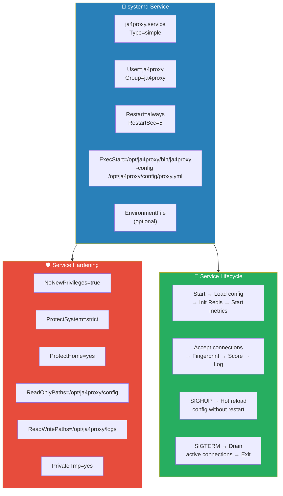
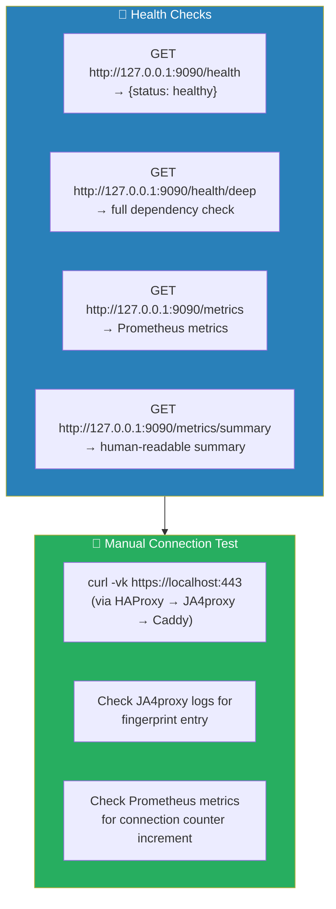
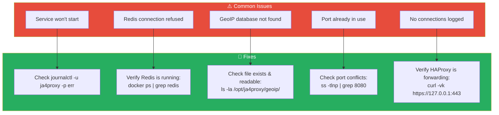

# Phase 3: JA4proxy Go Deployment

## Objective

Deploy the JA4proxy Go binary as a production-grade systemd service in **monitor-only mode** (dial=0). The proxy intercepts TLS Client Hello packets, fingerprints every connection, and logs everything — but blocks nothing.

---

## ⚠ Known issues (2026-04-15)

See `CRITICAL_REVIEW.md` for full context. Summary of defects affecting this phase:

1. **Upstream role reuse is aspirational.** `deploy/roles/03-ja4proxy-deploy/tasks/main.yml:19–33` emits a debug message acknowledging that JA4proxy4's Ansible role is not actually wired in. The role falls back to an inline `proxy.yml` template. This works, but:
   - The inline config may drift from the binary's schema over time with no compile-time check.
   - The "15+ security hardening flags" claim in `README.md` depends on whatever lives in `templates/ja4proxy.service.j2`; that file should be audited against a required-flags baseline, not assumed to have them.
2. **Binary integrity is not verified.** `deploy/roles/02-artifact-build/tasks/build.yml` computes a sha256 of the binary but never compares it to an expected value. Treat the "checksum generated" line as a provenance record, not a verification. See `PHASE_14_CI_AND_IDEMPOTENCY.md` §14.7 for the remediation.
3. **Counterfactual logging is configured but not validated.** `monitor_mode.counterfactuals: true` is written into `proxy.yml` but `deploy/roles/07-validation/` does not assert a `ja4proxy_counterfactual_*` metric is present post-deploy. Add a Phase 7 check that `curl -s http://127.0.0.1:9090/metrics | grep -q counterfactual` succeeds.
4. **AppArmor confinement is not active when this role finishes.** The profile is applied in Phase 8 via `lineinfile`, which modifies the unit file but does not restart the running process. Move the `AppArmorProfile=` directive into `templates/ja4proxy.service.j2` so it takes effect the first time the service starts (see `PHASE_08` known-issues note).

---

## 3.1 Deployment Overview



---

## 3.2 Create the systemd Service File

```bash
sudo cat > /etc/systemd/system/ja4proxy.service << 'EOF'
[Unit]
Description=JA4proxy — TLS Fingerprinting Research Proxy
Documentation=https://github.com/seanpor/JA4proxy
After=network-online.target
Wants=network-online.target
Requires=ja4proxy-redis.service

[Service]
Type=simple
User=ja4proxy
Group=ja4proxy

ExecStart=/opt/ja4proxy/bin/ja4proxy
Environment=CONFIG_PATH=/opt/ja4proxy/config/proxy.yml

> **⚠️ Verify before first deploy**: Confirm the actual JA4proxy binary accepts `CONFIG_PATH` as an environment variable. Check `cmd/proxy/main.go` in the upstream repo. If it uses a CLI flag instead, change to `ExecStart=/opt/ja4proxy/bin/ja4proxy -config /opt/ja4proxy/config/proxy.yml`. If it uses a different env var name, update accordingly.

Restart=always
RestartSec=5

# Graceful shutdown
TimeoutStopSec=35

# Logging
StandardOutput=journal
StandardError=journal
SyslogIdentifier=ja4proxy

# Security hardening
NoNewPrivileges=true
ProtectSystem=strict
ProtectHome=yes
PrivateTmp=yes
ProtectKernelTunables=true
ProtectKernelModules=true
ProtectControlGroups=true
RestrictSUIDSGID=true
RestrictNamespaces=true
LockPersonality=true
MemoryDenyWriteExecute=false
ReadWritePaths=/opt/ja4proxy/logs
ReadOnlyPaths=/opt/ja4proxy/config /opt/ja4proxy/geoip

# Resource limits
LimitNOFILE=65536
LimitNPROC=4096

# Environment (override in EnvironmentFile if needed)
Environment="GODEBUG=netdns=go"

[Install]
WantedBy=multi-user.target
EOF
```

---

## 3.3 Redis Service for Docker

Since Redis runs in Docker, we need a systemd wrapper that makes the JA4proxy service depend on it:

```bash
sudo cat > /etc/systemd/system/ja4proxy-redis.service << 'EOF'
[Unit]
Description=JA4proxy Redis (Docker)
Requires=docker.service
After=docker.service

[Service]
Type=oneshot
RemainAfterExit=yes
ExecStart=/usr/bin/docker compose -f /opt/ja4proxy-docker/docker-compose.yml up -d redis
ExecStop=/usr/bin/docker compose -f /opt/ja4proxy-docker/docker-compose.yml stop redis
WorkingDirectory=/opt/ja4proxy-docker

[Install]
WantedBy=multi-user.target
EOF
```

---

## 3.4 Enable and Start

```bash
# Reload systemd to pick up new units
sudo systemctl daemon-reload

# Verify the service file is valid
systemctl cat ja4proxy.service

# Enable (start on boot)
sudo systemctl enable ja4proxy.service

# Start the service
sudo systemctl start ja4proxy.service

# Check status
sudo systemctl status ja4proxy.service

# View logs
sudo journalctl -u ja4proxy.service -f --no-pager

# View recent errors
sudo journalctl -u ja4proxy.service -p err --no-pager -n 50
```

---

## 3.5 Health Verification



### Test the health endpoints:

```bash
# Basic health
curl -s http://127.0.0.1:9090/health | jq .

# Deep health (checks Redis connectivity, GeoIP DB, etc.)
curl -s http://127.0.0.1:9090/health/deep | jq .

# Metrics summary
curl -s http://127.0.0.1:9090/metrics/summary

# Full Prometheus metrics
curl -s http://127.0.0.1:9090/metrics | head -50
```

### Test a real connection:

```bash
# Make a test connection through HAProxy
curl -vk https://127.0.0.1:443/ 2>&1 | head -20

# Check if JA4proxy logged it
sudo journalctl -u ja4proxy.service --since "1 min ago" | grep -i "ja4\|fingerprint\|connection"

# Check Prometheus metrics for the connection
curl -s http://127.0.0.1:9090/metrics | grep ja4proxy_connections_total
```

---

## 3.6 Config Hot-Reload

JA4proxy supports config changes without restart:

```bash
# Edit the config file
sudo vim /opt/ja4proxy/config/proxy.yml

# Send SIGHUP to trigger hot-reload
sudo kill -SIGHUP $(pidof ja4proxy)

# Verify reload in logs
sudo journalctl -u ja4proxy.service --since "30 sec ago" | grep -i "reload\|config"

# Check metrics for reload counter
curl -s http://127.0.0.1:9090/metrics | grep ja4proxy_config_reloads
```

> **Important**: Not all config changes support hot-reload. Binding port changes require a restart. Most security policy, dial, JA4 lists, and rate limit changes DO support hot-reload.

---

## 3.7 Managing the Service

```bash
# Start / Stop / Restart
sudo systemctl start|stop|restart ja4proxy.service

# Check status
sudo systemctl status ja4proxy.service

# View live logs
sudo journalctl -u ja4proxy.service -f

# View logs from last hour
sudo journalctl -u ja4proxy.service --since "1 hour ago"

# View only fingerprint entries
sudo journalctl -u ja4proxy.service --since "1 hour ago" | grep "JA4"

# View only blocked/banned (when dial > 0)
sudo journalctl -u ja4proxy.service --since "1 hour ago" | grep -E "block|ban|tarpit"

# Graceful restart (drain active connections first)
sudo systemctl reload ja4proxy.service  # sends SIGHUP

# Check resource usage
systemctl show ja4proxy.service | grep -E "MemoryCurrent|TasksCurrent"

# Check uptime
systemctl show ja4proxy.service -p ActiveEnterTimestamp
```

---

## 3.8 Troubleshooting



### Diagnostic Commands

```bash
# Full service diagnostics
sudo systemctl status ja4proxy.service
sudo journalctl -u ja4proxy.service -n 100 --no-pager

# Check binary permissions and type
file /opt/ja4proxy/bin/ja4proxy
ls -la /opt/ja4proxy/bin/ja4proxy

# Check config syntax
# (JA4proxy will fail to start with bad config — check logs)

# Verify Redis connectivity from the binary's perspective
sudo -u ja4proxy redis-cli -h 127.0.0.1 -p 6379 -a "$(grep REDIS_PASSWORD /opt/ja4proxy-docker/.env | cut -d= -f2)" ping

# Check if ports are bound
ss -tlnp | grep -E "8080|9090|443|80"

# Check firewall
sudo ufw status verbose
```

---

## 3.9 Monitoring the Monitor

Key metrics to watch during initial deployment:

```bash
# Connection rate (last 5 minutes average)
curl -s http://127.0.0.1:9090/metrics | grep "ja4proxy_connections_total"

# Current active connections
curl -s http://127.0.0.1:9090/metrics | grep "ja4proxy_active_connections"

# Processing latency (should be sub-millisecond)
curl -s http://127.0.0.1:9090/metrics | grep "ja4proxy_pipeline_duration"

# Error rate
curl -s http://127.0.0.1:9090/metrics | grep "ja4proxy_connection_errors"

# Redis operations
curl -s http://127.0.0.1:9090/metrics | grep "ja4proxy_redis_operations"
```

---

## 3.10 Verification Checklist

```mermaid
flowchart LR
    subgraph Done["✅ Phase 3 Verification"]
        D1["✅ systemd service created"]
        D2["✅ Service enabled (starts on boot)"]
        D3["✅ Service running (active)"]
        D4["✅ /health returns healthy"]
        D5["✅ /health/deep passes all checks"]
        D6["✅ /metrics exposes Prometheus data"]
        D7["✅ Test connection logged with JA4 fingerprint"]
        D8["✅ Hot-reload works (SIGHUP)"]
        D9["✅ Graceful shutdown works"]
        D10["✅ No errors in journal logs"]
    end

    style Done fill:#27ae60,color:#fff
```



---

## Dependencies

- **Phase 1**: `ja4proxy` user exists, directories created, firewall allows 443/80
- **Phase 2**: Go binary deployed to `/opt/ja4proxy/bin/`, config at `/opt/ja4proxy/config/proxy.yml`
- **Phase 4**: Redis must be running (Docker) before JA4proxy starts
- **→ Phase 5**: Once confirmed working, research data collection begins

---

## Notes & Decisions

| Decision | Rationale |
|----------|-----------|
| systemd (not Docker) for JA4proxy | Go binary has no dependencies. systemd gives direct journal logging, resource limits, and no container overhead. |
| Depend on Redis via wrapper service | Redis runs in Docker; the wrapper bridges systemd dependency management. |
| 35s TimeoutStopSec | Matches drain_timeout_seconds (30s) + 5s buffer for graceful connection drain. |
| GODEBUG=netdns=go | Pure Go DNS resolver — avoids CGO dependency and potential resolver issues. |
| CONFIG_PATH via Environment | Avoids hardcoding config path in ExecStart. Easy to override per-environment. Verify actual binary supports this. |
| Monitor-only mode (dial=0) | Zero risk of blocking legitimate traffic. All data is logged for analysis before any blocking is enabled. |
| AppArmor profile (Phase 8) | Mandatory access control layer beyond systemd security flags. See Phase 8 for setup. |
