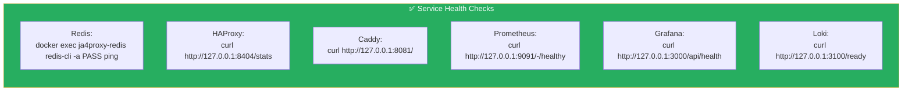

# Phase 4: Supporting Services (Docker Compose)

## Objective

Deploy all supporting infrastructure via Docker Compose. These are **pre-built official images** from Docker Hub — no compilation, no build chains, no source code on the server.

---

## 4.1 Service Architecture

```mermaid
flowchart TB
    subgraph Frontend["🌐 Frontend Networks (Internet-Accessible Ports)"]
        HAProxy["🔷 HAProxy :443, :80, :8404"]
        GrafanaUI["📈 Grafana :3000 (admin IP only)"]
        PrometheusUI["📊 Prometheus :9091 (admin IP only)"]
    end

    subgraph Internal["🔒 Internal Networks (No Host Ports)"]
        Redis["🔴 Redis :6379\n(ja4proxy-internal)"]
        Caddy["🟢 Caddy :8081\n(ja4proxy-internal)"]
        Loki["📋 Loki :3100\n(ja4proxy-monitoring)"]
        Promtail["📤 Promtail\n(ja4proxy-monitoring)"]
    end

    subgraph Binary["⚙️ Standalone (Not Docker)"]
        JA4["JA4proxy Go :8080, :9090\nsystemd managed"]
    end

    HAProxy -->|"TCP :8080| JA4
    JA4 -->|"forward :8081| Caddy
    JA4 <-->|"ban/rate :6379| Redis
    PrometheusUI -->|"scrape :9090| JA4
    PrometheusUI -->|"scrape :8404/stats| HAProxy
    PrometheusUI -->|"scrape :9090| PrometheusUI
    Promtail -->|"ship logs| Loki
    GrafanaUI -->|"query metrics| PrometheusUI
    GrafanaUI -->|"query logs| Loki

    style Frontend fill:#e67e22,color:#fff
    style Internal fill:#8e44ad,color:#fff
    style Binary fill:#e94560,color:#fff
```

### Network Segmentation

| Network | Purpose | Isolation |
|---------|---------|-----------|
| `ja4proxy-frontend` | Exposes ports to internet/admin | External-facing |
| `ja4proxy-internal` | Redis + Caddy (honeypot backend) | **internal=true** — no outbound internet |
| `ja4proxy-monitoring` | Prometheus, Grafana, Loki, Promtail | **internal=true** — no outbound internet |

---

## 4.2 Remaining Configuration Files

### 4.2.1 Prometheus Configuration

Create `/opt/ja4proxy-docker/config/prometheus/prometheus.yml`:

```yaml
global:
  scrape_interval: 15s
  evaluation_interval: 15s

scrape_configs:
  # JA4proxy metrics
  - job_name: 'ja4proxy'
    static_configs:
      - targets: ['host.docker.internal:9090']
        labels:
          component: 'ja4proxy'

  # Prometheus self-monitoring
  - job_name: 'prometheus'
    static_configs:
      - targets: ['localhost:9090']
        labels:
          component: 'prometheus'

  # HAProxy metrics — requires haproxy_exporter sidecar or HAProxy 2.8+ Prometheus export
  # Option A: If using haproxy_exporter (recommended)
  # - job_name: 'haproxy-exporter'
  #   static_configs:
  #     - targets: ['haproxy-exporter:9101']
  #       labels:
  #         component: 'haproxy'
  #
  # Option B: HAProxy 2.8+ native Prometheus endpoint
  # - job_name: 'haproxy'
  #   static_configs:
  #     - targets: ['haproxy:8405']  # Dedicated Prometheus port
  #       labels:
  #         component: 'haproxy'
  #
  # Option C: Scrape HAProxy CSV stats (less ideal but works)
  - job_name: 'haproxy-csv'
    metrics_path: '/stats'
    params:
      format: ['csv']
    static_configs:
      - targets: ['haproxy:8404']
        labels:
          component: 'haproxy'
```

> **Note**: `host.docker.internal` may not resolve on Linux Docker. Instead, use the host's Docker bridge IP. Add this to the Docker Compose `prometheus` service:
> ```yaml
> extra_hosts:
>   - "host.docker.internal:host-gateway"
> ```

### 4.2.2 Grafana Provisioning

Create `/opt/ja4proxy-docker/config/grafana/provisioning/datasources/datasources.yml`:

```yaml
apiVersion: 1

datasources:
  - name: Prometheus
    type: prometheus
    access: proxy
    url: http://prometheus:9090
    isDefault: true
    editable: false

  - name: Loki
    type: loki
    access: proxy
    url: http://loki:3100
    editable: false
```

Create `/opt/ja4proxy-docker/config/grafana/provisioning/dashboards/dashboards.yml`:

```yaml
apiVersion: 1

providers:
  - name: 'JA4proxy Research'
    orgId: 1
    folder: 'Research'
    type: file
    disableDeletion: false
    updateIntervalSeconds: 30
    options:
      path: /etc/grafana/dashboards
      foldersFromFilesStructure: true
```

### 4.2.3 Loki Configuration

Create `/opt/ja4proxy-docker/config/loki/loki.yml`:

```yaml
auth_enabled: false

server:
  http_listen_port: 3100

common:
  path_prefix: /loki
  storage:
    filesystem:
      chunks_directory: /loki/chunks
      rules_directory: /loki/rules
  replication_factor: 1
  ring:
    kvstore:
      store: inmemory

schema_config:
  configs:
    - from: 2024-01-01
      store: boltdb-shipper
      object_store: filesystem
      schema: v11
      index:
        prefix: index_
        period: 24h

storage_config:
  boltdb_shipper:
    active_index_directory: /loki/boltdb-shipper-active
    cache_location: /loki/boltdb-shipper-cache
    cache_ttl: 24h

limits_config:
  reject_old_samples: true
  reject_old_samples_max_age: 168h

chunk_store_config:
  max_look_back_period: 2160h  # 90 days

table_manager:
  retention_deletes_enabled: true
  retention_period: 2160h  # 90 days
```

### 4.2.4 Promtail Configuration

Create `/opt/ja4proxy-docker/config/promtail/promtail.yml`:

```yaml
server:
  http_listen_port: 9080
  grpc_listen_port: 0

positions:
  filename: /tmp/positions.yaml

clients:
  - url: http://loki:3100/loki/api/v1/push

scrape_configs:
  # JA4proxy journal logs (via host mount)
  - job_name: ja4proxy
    journal:
      json: false
      max_age: 12h
      labels:
        job: systemd-journal
        service: ja4proxy
    relabel_configs:
      - source_labels: ['__journal__systemd_unit']
        target_label: 'unit'

  # JA4proxy application logs (file mount)
  - job_name: ja4proxy-files
    static_configs:
      - targets:
          - localhost
        labels:
          job: ja4proxy-logs
          __path__: /opt/ja4proxy/logs/*.log

  # Docker container logs
  - job_name: docker
    docker_sd_configs:
      - host: unix:///var/run/docker.sock
        refresh_interval: 5s
    relabel_configs:
      - source_labels: ['__meta_docker_container_name']
        target_label: 'container'
      - source_labels: ['__meta_docker_container_log_stream']
        target_label: 'logstream'
```

> **Note**: Promtail needs access to the Docker socket. Add to the Docker Compose service:
> ```yaml
> volumes:
>   - /var/run/docker.sock:/var/run/docker.sock:ro
> ```

### 4.2.5 Updated Docker Compose with extra_hosts

The `prometheus` service in the Phase 2 docker-compose.yml needs this addition:

```yaml
  prometheus:
    # ... existing config ...
    extra_hosts:
      - "host.docker.internal:host-gateway"
```

And `promtail` needs the Docker socket:

```yaml
  promtail:
    # ... existing config ...
    volumes:
      - /var/run/docker.sock:/var/run/docker.sock:ro
      - ./config/promtail/promtail.yml:/etc/promtail/config.yml:ro
      - /opt/ja4proxy/logs:/opt/ja4proxy/logs:ro
```

---

## 4.3 Start the Stack

```bash
cd /opt/ja4proxy-docker

# Validate the compose file
docker compose config

# Pull all images first
docker compose pull

# Start all services
docker compose up -d

# Check all containers are running
docker compose ps

# View logs for all services
docker compose logs -f

# View logs for a specific service
docker compose logs -f redis
docker compose logs -f caddy
docker compose logs -f haproxy
```

---

## 4.4 Verification



```bash
# Redis
docker exec ja4proxy-redis redis-cli -a "$(grep REDIS_PASSWORD .env | cut -d= -f2)" ping
# Expected: PONG

# HAProxy stats page
curl -s http://127.0.0.1:8404/stats | head -5

# Caddy honeypot
curl -s http://127.0.0.1:8081/ | grep -o "RESEARCH HONEYPOT"
# Expected: RESEARCH HONEYPOT

# Prometheus health
curl -s http://127.0.0.1:9091/-/healthy
# Expected: Prometheus Server is Healthy.

# Grafana health
curl -s http://admin:$(grep GRAFANA_ADMIN_PASSWORD .env | cut -d= -f2)@127.0.0.1:3000/api/health
# Expected: {"commit":"...","database":"ok","version":"..."}

# Loki ready
curl -s http://127.0.0.1:3100/ready
# Expected: ready
```

---

## 4.5 End-to-End Test

```bash
# Full flow test: Internet → HAProxy → JA4proxy → Caddy
curl -vk https://127.0.0.1:443/ 2>&1

# Should see:
# 1. HAProxy accepts TLS on :443
# 2. JA4proxy fingerprints the ClientHello
# 3. Connection forwarded to Caddy on :8081
# 4. Caddy serves the honeypot HTML
# 5. JA4proxy logs the JA4 fingerprint
```

### Verify the full pipeline:

```bash
# 1. Check HAProxy accepted the connection
docker logs ja4proxy-haproxy 2>&1 | tail -5

# 2. Check JA4proxy logged the fingerprint
sudo journalctl -u ja4proxy.service --since "1 min ago" | grep -i "JA4"

# 3. Check Caddy served the page
docker logs ja4proxy-honeypot 2>&1 | tail -5

# 4. Check Prometheus recorded the metric
curl -s http://127.0.0.1:9090/metrics | grep "ja4proxy_connections_total"

# 5. Check Promtail shipped logs to Loki
curl -s 'http://127.0.0.1:3100/loki/api/v1/query?query={service="ja4proxy"}&limit=1'
```

---

## 4.6 Resource Monitoring

```bash
# Docker container resource usage
docker stats --no-stream

# Individual container limits
docker inspect ja4proxy-redis --format '{{.HostConfig.Memory}}'

# Host-level resource usage
htop
free -h
df -h
```

---

## 4.7 Docker Compose Operations

```bash
# Start all
cd /opt/ja4proxy-docker && docker compose up -d

# Stop all (preserves data volumes)
docker compose stop

# Stop and remove containers (preserves volumes)
docker compose down

# Full reset (destroys all data)
docker compose down -v

# Restart a single service
docker compose restart redis

# View logs
docker compose logs -f --tail=100

# Rebuild after config change (recreates containers only)
docker compose up -d --force-recreate

# Pull latest images
docker compose pull
docker compose up -d
```

---

## 4.8 Verification Checklist

```mermaid
flowchart LR
    subgraph Done["✅ Phase 4 Verification"]
        D1["✅ All containers running"]
        D2["✅ Redis responds to PING"]
        D3["✅ HAProxy serving on :443"]
        D4["✅ Caddy serving honeypot HTML"]
        D5["✅ Prometheus scraping JA4proxy"]
        D6["✅ Grafana accessible (admin IP)"]
        D7["✅ Loki ready and accepting logs"]
        D8["✅ Promtail shipping logs"]
        D9["✅ End-to-end: curl :443 returns honeypot"]
        D10["✅ JA4 fingerprint in logs"]
        D11["✅ Metrics counter incremented"]
        D12["✅ Network isolation verified"]
    end

    style Done fill:#27ae60,color:#fff
```



```bash
# Network isolation test — internal containers can't reach internet
docker exec ja4proxy-redis ping -c1 -W2 8.8.8.8
# Expected: fail (network unreachable)

# But Redis can reach JA4proxy (on host)
docker exec ja4proxy-redis ping -c1 -W2 host.docker.internal
# Depends on network config
```

---

## Dependencies

- **Phase 1**: Docker installed and hardened, directories created
- **Phase 2**: All config files and docker-compose.yml deployed
- **Phase 3**: JA4proxy binary running and healthy
- **→ Phase 5**: Full stack operational — research data collection begins

---

## Notes & Decisions

| Decision | Rationale |
|----------|-----------|
| Internal Docker networks (no internet) | Redis, Caddy, Loki have no reason to reach the internet. Reduces blast radius if compromised. |
| Prometheus on host port 9091 (not 9090) | Avoids conflict with JA4proxy's own :9090 metrics port. |
| Promtail reads Docker socket | Only way to discover and tail all container logs. Read-only mount is safe. |
| 90-day retention for metrics and logs | Enough for research analysis cycles. Can extend if storage allows. |
| No Alertmanager initially | Research mode — we monitor manually. Add alerting in Phase 6. |
| HAProxy metrics via CSV scrape | HAProxy stats page is HTML; CSV format (`?format=csv`) is parseable by Prometheus. For production, use haproxy_exporter. |
| No docker-compose version key | Docker Compose v2 doesn't need it; removing avoids deprecation warnings. |
