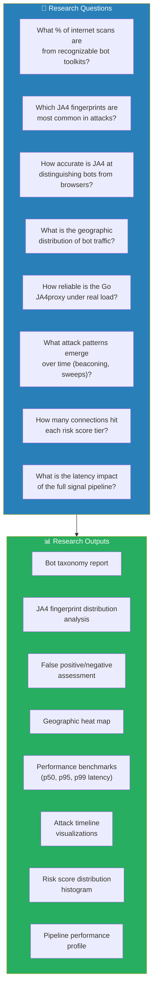
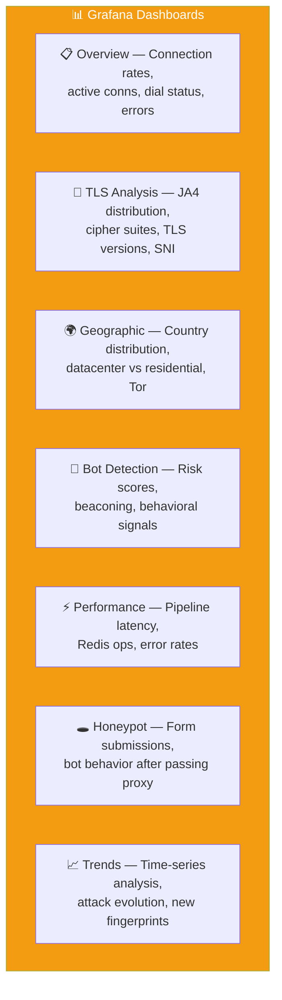
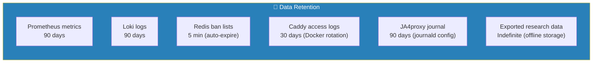
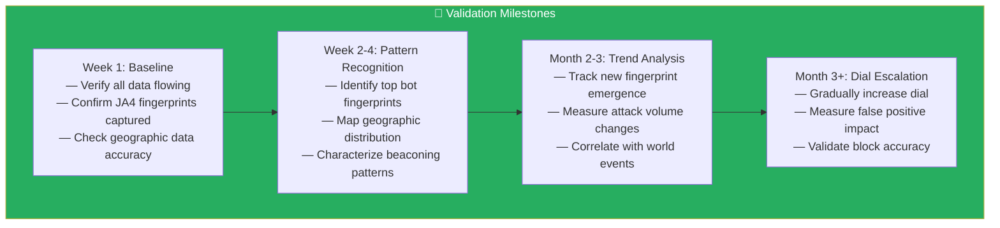
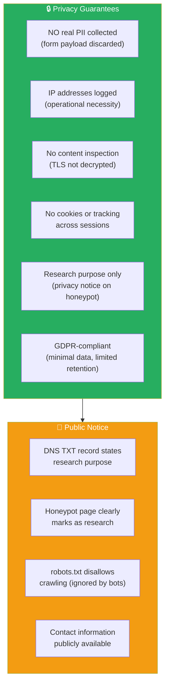

# Phase 5: Data Collection & Research Plan

## Objective

Define exactly what data we collect, how we analyze it, retention policies, and the research questions this setup is designed to answer.

---

## 5.1 Research Questions



---

## 5.2 Data Collected — Complete Inventory

```mermaid
flowchart LR
    subgraph TLS["🔐 TLS Layer (ClientHello)"]
        T1["JA4 fingerprint\n(t13d1517h2_...)"]
        T2["JA4X extended\nfingerprint"]
        T3["JA4T TCP-level\nfingerprint"]
        T4["TLS version\nattempted"]
        T5["Cipher suites\noffered"]
        T6["TLS extensions\npresent"]
        T7["ALPN values\n(h2, h1, etc.)"]
        T8["SNI hostname\nrequested"]
    end

    subgraph Network["🌐 Network Layer"]
        N1["Source IP\naddress"]
        N2["GeoIP country\ncode"]
        N3["ASN number\n+ organization"]
        N4["Datacenter vs\nresidential"]
        N5["Tor exit node\nflag"]
    end

    subgraph Behavior["📈 Behavioral Layer"]
        B1["Connection rate\n(conns/sec)"]
        B2["Beaconing score\n(periodicity)"]
        B3["Probing pattern\n(enumeration)"]
        B4["Burst detection\n(rapid connections)"]
        B5["Connection\nlifespan"]
        B6["Return visitor\nflag"]
        B7["TLS alerts\ntriggered"]
    end

    subgraph Decision["⚖️ Decision Layer"]
        D1["Risk score\n(0-100)"]
        D2["Action taken\n(allow/block/tarpit/ban)"]
        D3["Block reason\n(rule matched)"]
        D4["Counterfactual\n(would block at higher dial)"]
        D5["Dial setting\nat time of decision"]
        D6["Bypass rule\napplied (if any)"]
    end

    subgraph Ops["⚙️ Operational Layer"]
        O1["Pipeline duration\n(per connection)"]
        O2["Connection errors\n(by type)"]
        O3["Redis operations\n(count, latency)"]
        O4["Tarpit stats\n(concurrent, overflow)"]
        O5["Ban lifecycle\n(create, expire)"]
        O6["Config reloads\n(count, status)"]
        O7["Signal module\nhit counts"]
    end

    TLS --> Decision
    Network --> Decision
    Behavior --> Decision
    Decision --> Ops

    style TLS fill:#e94560,color:#fff
    style Network fill:#2980b9,color:#fff
    style Behavior fill:#f39c12,color:#fff
    style Decision fill:#c0392b,color:#fff
    style Ops fill:#8e44ad,color:#fff
```



---

## 5.3 Prometheus Metrics Registry

### Counter Metrics (monotonically increasing)

| Metric | Labels | Description |
|--------|--------|-------------|
| `ja4proxy_connections_total` | `action`, `ja4`, `country` | Total connections by action taken |
| `ja4proxy_security_events_total` | `type` | Security events by type |
| `ja4proxy_signal_total` | `name` | Signal module triggers |
| `ja4proxy_bypass_total` | `rule` | Bypass rule matches |
| `ja4proxy_dial_changes_total` | — | Dial setting changes |
| `ja4proxy_config_reloads_total` | `result` | Config hot-reload attempts |
| `ja4proxy_blocklist_matches_total` | `list` | Blocklist hits |
| `ja4proxy_abuseipdb_lookups_total` | `result` | AbuseIPDB API lookups |
| `ja4proxy_dns_enrichment_total` | `result` | DNS enrichment results |
| `ja4proxy_sni_signal_total` | `signal` | SNI analysis signals |
| `ja4proxy_tcp_signal_total` | `signal` | TCP analysis signals |
| `ja4proxy_asn_classification_total` | `type` | ASN classification results |
| `ja4proxy_weak_cipher_total` | — | Weak cipher attempts |
| `ja4proxy_connection_errors_total` | `error_type` | Connection errors by type |
| `ja4proxy_redis_operations_total` | `command`, `result` | Redis operation counts |

### Gauge Metrics (point-in-time values)

| Metric | Description |
|--------|-------------|
| `ja4proxy_active_connections` | Currently active connections |
| `ja4proxy_dial_current` | Current dial setting (0–100) |
| `ja4proxy_tarpit_concurrent` | Concurrently tarpitted connections |
| `ja4proxy_dns_enrichment_queue_depth` | Pending DNS enrichment |
| `ja4proxy_rdap_enrichment_queue_depth` | Pending RDAP enrichment |
| `ja4proxy_tor_exit_list_entries` | Tor exit nodes loaded |
| `ja4proxy_write_buffer_queue_depth` | Pending writes to Redis |
| `ja4proxy_tls_cert_expiry_timestamp_seconds` | TLS cert expiry |
| `ja4proxy_sync_clock_drift_seconds` | NTP clock drift |

### Histogram Metrics (distribution data)

| Metric | Buckets | Description |
|--------|---------|-------------|
| `ja4proxy_risk_score` | 0,10,25,40,55,70,85,100 | Risk score distribution |
| `ja4proxy_pipeline_duration_seconds` | standard | End-to-end processing time |
| `ja4proxy_sni_dga_score` | standard | SNI DGA detection scores |
| `ja4proxy_connection_duration_seconds` | standard | Connection duration distribution |

---

## 5.4 Grafana Dashboard Plan



### Dashboard 1: Overview

```
Panel 1: Connections/sec (time series)
  - Query: rate(ja4proxy_connections_total[1m]) by (action)
  - Stacked bar chart, grouped by action (allow, flag, tarpit, block, ban)

Panel 2: Active connections (gauge)
  - Query: ja4proxy_active_connections
  - Single stat with sparkline

Panel 3: Current dial setting (gauge)
  - Query: ja4proxy_dial_current
  - Gauge 0–100

Panel 4: Connection errors (time series)
  - Query: rate(ja4proxy_connection_errors_total[5m]) by (error_type)
  - Stacked area chart

Panel 5: Config reloads (stat)
  - Query: ja4proxy_config_reloads_total
  - Single stat (total count)
```

### Dashboard 2: TLS Analysis

```
Panel 1: Top 20 JA4 fingerprints (table)
  - Query: topk(20, sum by (ja4) (rate(ja4proxy_connections_total[1h])))
  - Table with JA4, count, percentage

Panel 2: JA4 fingerprint distribution (pie)
  - Query: sum by (ja4) (ja4proxy_connections_total)
  - Pie chart of top fingerprints

Panel 3: TLS version distribution (bar)
  - Query: sum by (tls_version) (ja4proxy_connections_total)
  - Bar chart: SSLv3, TLS1.0, 1.1, 1.2, 1.3

Panel 4: Cipher suite analysis (table)
  - Query: from logs, extract cipher suites
  - Table of most common cipher combinations

Panel 5: SNI analysis (bar)
  - Query: from logs, SNI domains grouped by TLD
  - Bar chart of top requested domains
```

### Dashboard 3: Geographic

```
Panel 1: Connections by country (bar)
  - Query: sum by (country) (rate(ja4proxy_connections_total[1h]))
  - Horizontal bar chart

Panel 2: Datacenter vs Residential (pie)
  - Query: ja4proxy_asn_classification_total by (type)
  - Pie chart

Panel 3: Tor exit node connections (stat + time series)
  - Query: ja4proxy_asn_classification_total{type="tor"}
  - Stat + trend line

Panel 4: World map (geomap)
  - Query: sum by (country) (ja4proxy_connections_total)
  - Geomap panel with country codes
```

### Dashboard 4: Bot Detection

```
Panel 1: Risk score distribution (histogram)
  - Query: histogram_quantile(0.95, rate(ja4proxy_risk_score_bucket[5m]))
  - Histogram

Panel 2: Beaconing detections (time series)
  - Query: rate(ja4proxy_signal_total{name="beaconing"}[5m])
  - Line chart

Panel 3: Behavioral signals (stacked bar)
  - Query: rate(ja4proxy_signal_total[5m]) by (name)
  - Stacked bar by signal type

Panel 4: Ban lifecycle (time series)
  - Query: rate(ja4proxy_connections_total{action="ban"}[5m])
  - Line chart of ban rate
```

### Dashboard 5: Performance

```
Panel 1: Pipeline latency (heatmap)
  - Query: histogram_quantile(0.50/0.95/0.99, rate(ja4proxy_pipeline_duration_seconds_bucket[5m]))
  - Heatmap or line chart (p50, p95, p99)

Panel 2: Redis operations (time series)
  - Query: rate(ja4proxy_redis_operations_total[1m]) by (command)
  - Stacked area

Panel 3: Tarpit usage (stat + gauge)
  - Query: ja4proxy_tarpit_concurrent
  - Gauge + trend

Panel 4: Connection errors by type (table)
  - Query: ja4proxy_connection_errors_total by (error_type)
  - Table with counts
```

---

## 5.5 Log Schema

### JA4proxy Log Entries (journal + Loki)

```json
{
  "timestamp": "2025-04-12T14:30:00.123Z",
  "level": "info",
  "component": "ja4proxy",
  "event": "connection_processed",
  "client_ip": "1.2.3.4",
  "country": "CN",
  "ja4": "t13d1517h2_55b913a317d9_6d97a5d9d4d0",
  "ja4x": "t13d1517h2_...",
  "ja4t": "...",
  "tls_version": "TLS1.3",
  "sni": "example.com",
  "alpn": "h2",
  "asn": "AS4134 Chinanet",
  "asn_type": "datacenter",
  "risk_score": 45,
  "action": "allow",
  "dial": 0,
  "pipeline_ms": 0.8,
  "bypass_matched": "none",
  "block_reason": "none",
  "counterfactual_action": "flag"
}
```

### Honeypot Submission Logs (Caddy)

```json
{
  "timestamp": "2025-04-12T14:30:05.456Z",
  "component": "caddy-honeypot",
  "event": "form_submission",
  "client_ip": "1.2.3.4",
  "ja4": "t13d1517h2_...",
  "user_agent_header": "...",
  "form_fields_received": true,
  "payload_discarded": true,
  "request_method": "POST",
  "request_path": "/submit"
}
```

---

## 5.6 Retention Policy



| Data Type | Retention | Rationale |
|-----------|-----------|-----------|
| Prometheus metrics | 90 days | Enough for trend analysis. Storage: ~2-5GB for 90 days at moderate traffic. |
| Loki logs | 90 days | Forensic analysis window. Storage: ~5-10GB depending on traffic. |
| Redis ban lists | 5 minutes | Auto-expiring TTL. Only for active enforcement. |
| Docker container logs | 30 days | Docker log rotation (50MB × 3 files). Short-term debugging. |
| systemd journal | 90 days | Configure via `journald.conf`: `MaxRetentionSec=90d` |
| Exported research data | Indefinite | Periodic exports (CSV, JSON) stored offline for analysis. |

### Configure journald Retention

```bash
# Edit journald config
sudo cat >> /etc/systemd/journald.conf << 'EOF'

# JA4proxy research — extended retention
MaxRetentionSec=90d
MaxUse=2G
SystemMaxUse=2G
EOF

# Restart journald
sudo systemctl restart systemd-journald
```

---

## 5.7 Data Export for Analysis

```bash
# Export Prometheus metrics as CSV
# (Run from admin machine, SSH-tunneled to Prometheus)
curl -s 'http://127.0.0.1:9091/api/v1/query?query=ja4proxy_connections_total' \
  | jq '.data.result[] | {metric: .metric, value: .value[1]}' \
  > /tmp/ja4proxy-metrics-$(date +%Y%m%d).json

# Export Loki logs
curl -s 'http://127.0.0.1:3100/loki/api/v1/query_range?query={service="ja4proxy"}&limit=10000' \
  > /tmp/ja4proxy-logs-$(date +%Y%m%d).json

# Export JA4 fingerprint distribution
curl -s 'http://127.0.0.1:9091/api/v1/query?query=sum%20by%20(ja4)%20(ja4proxy_connections_total)' \
  | jq '.data.result[] | {ja4: .metric.ja4, count: .value[1]}' \
  > /tmp/ja4-distribution-$(date +%Y%m%d).json
```

### Scheduled Exports (cron on admin machine)

```bash
# Weekly export
0 3 * * 0 ssh adminuser@<VM_IP> 'bash /opt/ja4proxy/scripts/export-data.sh' \
  && scp adminuser@<VM_IP>:/tmp/ja4proxy-*.json /local/research-data/
```

---

## 5.8 Research Validation Plan



---

## 5.9 Data Privacy & Compliance



---

## Dependencies

- **Phase 3**: JA4proxy generating metrics and logs
- **Phase 4**: Prometheus, Grafana, Loki running and ingesting data
- **→ Phase 6**: Operational security and monitoring built on top of this data

---

## Notes & Decisions

| Decision | Rationale |
|----------|-----------|
| 90-day retention | Balances research needs with storage costs. Can extend if needed. |
| Counterfactuals enabled | Critical for research — lets us analyze "what would happen if we blocked" without actually blocking. |
| Debug-level logging initially | Maximum data collection. Can reduce to info/warn once we understand traffic patterns. |
| No PII in honeypot | Form explicitly requests fake data, discards all submissions. IP logged for operational purposes only. |
| Weekly data exports | Ensures research data survives VM lifecycle. Offline analysis without impacting the server. |
