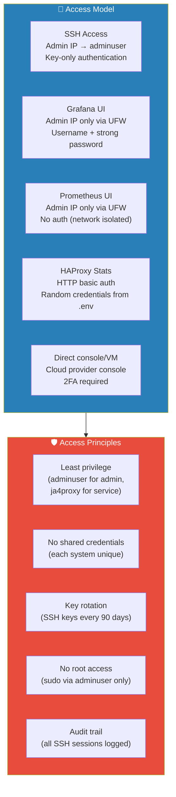
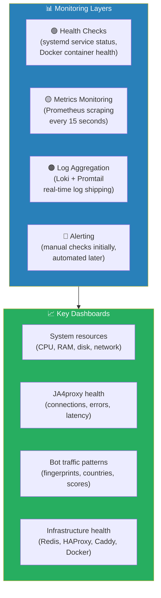
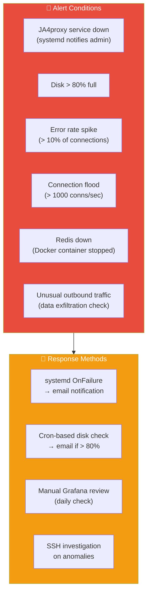
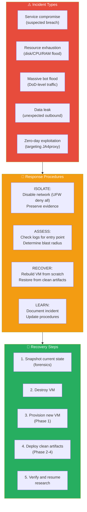
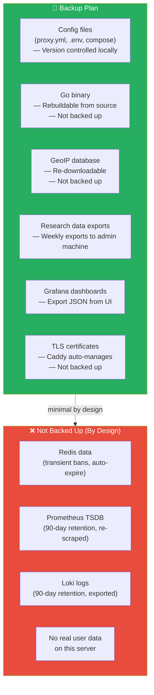

# Phase 6: Operational Security & Monitoring

## Objective

Establish secure operational procedures for managing the internet-facing research VM — access control, monitoring, alerting, incident response, and backups.

---

## 6.1 Access Control Model



### SSH Key Rotation

```bash
# On admin machine (every 90 days)
ssh-keygen -t ed25519 -C "adminuser-$(date +%Y%m)" -f ~/.ssh/ja4proxy-research

# Copy new key
ssh-copy-id -i ~/.ssh/ja4proxy-research adminuser@<VM_IP>

# Remove old key from VM
ssh adminuser@<VM_IP> 'vim ~/.ssh/authorized_keys'

# Update local SSH config
cat >> ~/.ssh/config << EOF

Host ja4proxy-research
    HostName <VM_IP>
    User adminuser
    IdentityFile ~/.ssh/ja4proxy-research
    IdentitiesOnly yes
EOF
```

---

## 6.2 Monitoring Strategy



### Daily Checks (Manual)

```bash
# SSH in and run quick health check
ssh adminuser@<VM_IP>

# System overview
echo "=== System Overview ==="
uptime
free -h
df -h
echo ""

# Service status
echo "=== Services ==="
sudo systemctl is-active ja4proxy
docker compose -f /opt/ja4proxy-docker/docker-compose.yml ps --format "table {{.Name}}\t{{.Status}}"
echo ""

# Connection rate (last hour)
echo "=== Connections (last hour) ==="
curl -s http://127.0.0.1:9090/metrics | grep "ja4proxy_connections_total"
echo ""

# Error check
echo "=== Recent Errors ==="
sudo journalctl -u ja4proxy.service --since "1 hour ago" -p err --no-pager | tail -10
echo ""

# Disk usage for logs
echo "=== Log Sizes ==="
sudo journalctl --disk-usage
du -sh /opt/ja4proxy/logs/ 2>/dev/null
```

### Weekly Checks

```bash
# Top JA4 fingerprints this week
curl -s 'http://127.0.0.1:9091/api/v1/query?query=topk(10,%20sum%20by(ja4)(increase(ja4proxy_connections_total%5B7d%5D)))' \
  | jq '.data.result[] | {ja4: .metric.ja4, count: .value[1]}'

# Country distribution
curl -s 'http://127.0.0.1:9091/api/v1/query?query=sum%20by(country)(increase(ja4proxy_connections_total%5B7d%5D))' \
  | jq '.data.result[] | {country: .metric.country, count: .value[1]}'

# Error rate trend
curl -s 'http://127.0.0.1:9091/api/v1/query?query=increase(ja4proxy_connection_errors_total%5B7d%5D)' \
  | jq '.data.result[] | {error: .metric.error_type, count: .value[1]}'

# Docker resource usage
docker system df
docker ps --format "table {{.Names}}\t{{.Status}}\t{{.Ports}}"
```

---

## 6.3 Alerting (Manual Initially)



### systemd OnFailure Notification

```bash
# Create a notification script
sudo cat > /opt/ja4proxy/scripts/notify-failure.sh << 'EOF'
#!/bin/bash
SERVICE_NAME="$1"
TIMESTAMP=$(date -u +%Y-%m-%dT%H:%M:%SZ)
echo "ALERT: Service $SERVICE_NAME failed at $TIMESTAMP on $(hostname)" | \
  mail -s "JA4proxy Research VM: $SERVICE_NAME failed" admin@example.com
EOF
sudo chmod +x /opt/ja4proxy/scripts/notify-failure.sh

# Create a failure handler template
sudo cat > /etc/systemd/system/alert@.service << 'EOF'
[Unit]
Description=Alert Handler for %i

[Service]
Type=oneshot
ExecStart=/opt/ja4proxy/scripts/notify-failure.sh %i
EOF

# Add to ja4proxy.service
# Add this line to the [Unit] section:
# OnFailure=alert@%n.service
```

### Disk Usage Monitor (cron)

```bash
# Add to adminuser's crontab
crontab -e

# Add this line (runs daily at 6 AM)
0 6 * * * /bin/bash -c 'USED=$(df / --output=pcent | tail -1 | tr -d "%"); if [ "$USED" -gt 80 ]; then echo "Disk usage at ${USED}%" | mail -s "JA4proxy VM: Disk Warning" admin@example.com; fi'
```

---

## 6.4 Incident Response Plan



### Emergency Kill Switch

```bash
# Immediate network isolation
sudo ufw default deny incoming
sudo ufw disable

# Or more surgical — block everything except SSH
sudo ufw --force reset
sudo ufw default deny incoming
sudo ufw default deny outgoing
sudo ufw allow from <ADMIN_IP> to any port 22 proto tcp
sudo ufw allow out to any port 53 proto udp    # DNS
sudo ufw allow out to any port 53 proto tcp    # DNS
sudo ufw --force enable

# This cuts all internet traffic except SSH from admin IP
```

### Evidence Preservation

```bash
# Before shutting down, preserve evidence
TIMESTAMP=$(date +%Y%m%d_%H%M%S)

# Save all logs
sudo journalctl -u ja4proxy.service --no-pager > /tmp/evidence-ja4proxy-${TIMESTAMP}.log
sudo journalctl --since "7 days ago" --no-pager > /tmp/evidence-journal-${TIMESTAMP}.log
docker compose -f /opt/ja4proxy-docker/docker-compose.yml logs > /tmp/evidence-docker-${TIMESTAMP}.log

# Save current state
sudo systemctl status > /tmp/evidence-services-${TIMESTAMP}.txt
docker ps -a > /tmp/evidence-containers-${TIMESTAMP}.txt
sudo ufw status verbose > /tmp/evidence-firewall-${TIMESTAMP}.txt
ss -tlnp > /tmp/evidence-ports-${TIMESTAMP}.txt

# Download evidence to admin machine
scp adminuser@<VM_IP>:/tmp/evidence-*-${TIMESTAMP}.* /local/evidence/
```

---

## 6.5 Backup Strategy



### Backup Script (configs only)

```bash
#!/bin/bash
# /opt/ja4proxy/scripts/backup-configs.sh
BACKUP_DIR="/tmp/ja4proxy-backup-$(date +%Y%m%d)"
mkdir -p "$BACKUP_DIR"

# Copy configs
cp /opt/ja4proxy/config/proxy.yml "$BACKUP_DIR/"
cp /opt/ja4proxy-docker/.env "$BACKUP_DIR/"
cp /opt/ja4proxy-docker/docker-compose.yml "$BACKUP_DIR/"
cp -r /opt/ja4proxy-docker/config/ "$BACKUP_DIR/"

# Compress
tar czf "$BACKUP_DIR.tar.gz" -C /tmp "$BACKUP_DIR"
rm -rf "$BACKUP_DIR"

echo "Backup: $BACKUP_DIR.tar.gz"
# SCP to admin machine from there
```

> **Key insight**: Since this is a research honeypot with no real data, backup needs are minimal. All configs are version-controlled locally. The VM can be destroyed and rebuilt from scratch in under an hour.

---

## 6.6 Security Audit Checklist

```mermaid
flowchart LR
    subgraph Audit["🔍 Monthly Security Audit"]
        A1["Review SSH authorized_keys\n(no unexpected entries)"]
        A2["Check running processes\n(no unexpected services)"]
        A3["Review open ports\n(only 80, 443, admin ports)"]
        A4["Check UFW logs\n(for blocked scan attempts)"]
        A5["Review Docker images\n(no unexpected images)"]
        A6["Check file integrity\n(binary checksums match)"]
        A7["Review systemd timers\n(no unexpected cron)"]
        A8["Check outbound connections\n(no data exfiltration)"]
        A9["Verify TLS certificates\n(Caddy auto-renewal working)"]
        A10["Review fail2ban stats\n(banned IPs, false positives)"]
    end

    style Audit fill:#2980b9,color:#fff
```



### Audit Commands

```bash
# SSH keys
cat ~/.ssh/authorized_keys

# Running processes
ps aux --sort=-%mem | head -20

# Open ports
ss -tlnp

# UFW denied attempts (last 24h)
sudo grep "UFW BLOCK" /var/log/ufw.log 2>/dev/null | wc -l
sudo grep "UFW BLOCK" /var/log/ufw.log 2>/dev/null | awk '{print $9}' | sort | uniq -c | sort -rn | head -20

# Docker images
docker images

# Binary integrity
sha256sum /opt/ja4proxy/bin/ja4proxy
# Compare against original checksum from Phase 2

# systemd timers
systemctl list-timers --all

# Outbound connections (established)
ss -tnp state established

# TLS cert status
docker exec ja4proxy-honeypot ls -la /data/caddy/certificates/
```

---

## 6.7 Verification Checklist

```mermaid
flowchart LR
    subgraph Done["✅ Phase 6 Verification"]
        D1["✅ SSH access locked down (keys only, admin IP)"]
        D2["✅ Grafana accessible (admin IP, strong password)"]
        D3["✅ Daily health check procedure documented"]
        D4["✅ Weekly analysis procedure documented"]
        D5["✅ Alert conditions defined"]
        D6["✅ Incident response plan documented"]
        D7["✅ Emergency kill switch tested"]
        D8["✅ Backup procedure for configs defined"]
        D9["✅ Security audit checklist created"]
        D10["✅ Evidence preservation procedure documented"]
    end

    style Done fill:#27ae60,color:#fff
```



---

## Dependencies

- **Phase 5**: Data collection pipeline established — this phase secures and monitors it
- **→ Phase 7**: All operational procedures in place before validation testing begins

---

## Notes & Decisions

| Decision | Rationale |
|----------|-----------|
| Manual monitoring initially | Research phase — no need for complex alerting. Daily manual checks are sufficient. |
| No external notification service | Avoids adding dependencies (email, Slack, PagerDuty). Simple email via `mail` command is enough. |
| Minimal backups | Server is disposable. Configs are in git. Data is exported weekly. Rebuild from scratch is the DR plan. |
| Kill switch is UFW disable | Fastest way to isolate. Can be reversed by re-enabling. No need to destroy the VM unless compromised. |
| Monthly security audit | Balanced frequency for a research server. Increase to weekly if dial > 50 (active blocking). |
