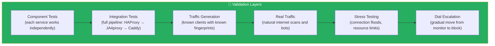
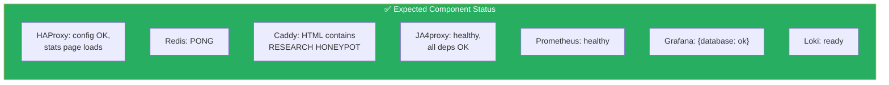
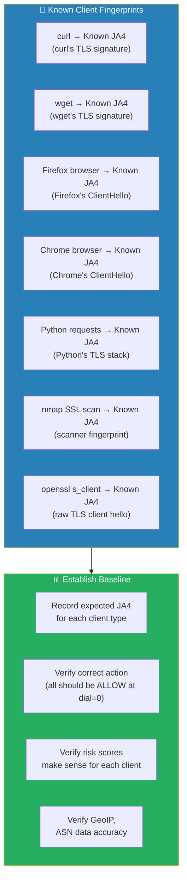
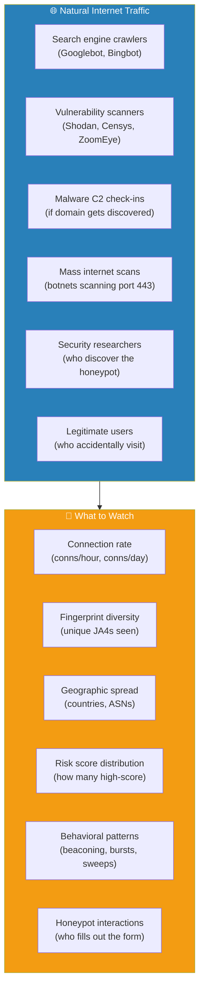
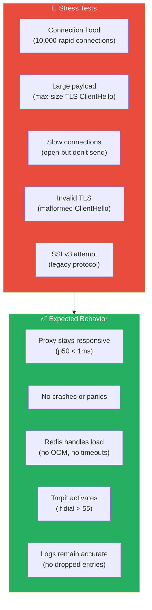
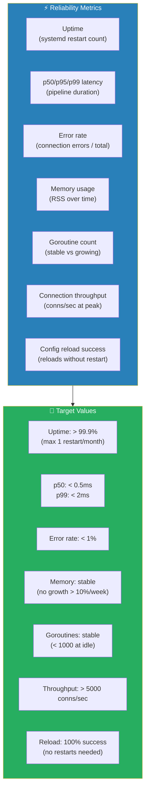
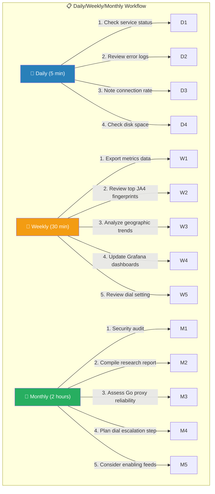

# Phase 7: Validation & Testing

## Objective

Verify the entire stack works correctly under real internet traffic, generate controlled test traffic for validation, and establish a dial escalation plan to move from pure monitoring to active blocking.

---

## 7.1 Validation Architecture



---

## 7.2 Component-Level Validation

### Step 1: Verify Each Component Independently

```bash
# ── HAProxy ──
echo "=== HAProxy ==="
docker exec ja4proxy-haproxy haproxy -c -f /usr/local/etc/haproxy/haproxy.cfg
curl -s http://127.0.0.1:8404/stats | head -1
echo ""

# ── Redis ──
echo "=== Redis ==="
docker exec ja4proxy-redis redis-cli -a "$(grep REDIS_PASSWORD /opt/ja4proxy-docker/.env | cut -d= -f2)" PING
echo ""

# ── Caddy ──
echo "=== Caddy ==="
curl -s http://127.0.0.1:8081/ | grep -o "RESEARCH HONEYPOT"
echo ""

# ── JA4proxy ──
echo "=== JA4proxy ==="
curl -s http://127.0.0.1:9090/health | jq .
curl -s http://127.0.0.1:9090/health/deep | jq .
echo ""

# ── Prometheus ──
echo "=== Prometheus ==="
curl -s http://127.0.0.1:9091/-/healthy
echo ""

# ── Grafana ──
echo "=== Grafana ==="
curl -s -u admin:$(grep GRAFANA_ADMIN_PASSWORD /opt/ja4proxy-docker/.env | cut -d= -f2) \
  http://127.0.0.1:3000/api/health | jq .
echo ""

# ── Loki ──
echo "=== Loki ==="
curl -s http://127.0.0.1:3100/ready
echo ""
```

### Expected Results



---

## 7.3 End-to-End Integration Test

```bash
# ── Test 1: Full pipeline via HTTPS ──
echo "=== Full HTTPS pipeline ==="
curl -vk https://127.0.0.1:443/ 2>&1

# Should see:
# - TLS handshake succeeds (via HAProxy passthrough → Caddy)
# - HTTP 200 with honeypot HTML
# - JA4proxy logs the connection fingerprint

# ── Test 2: Verify JA4proxy logged it ──
echo "=== JA4proxy logs ==="
sudo journalctl -u ja4proxy.service --since "2 min ago" | grep -i "JA4\|connection"

# ── Test 3: Verify Prometheus recorded it ──
echo "=== Prometheus metrics ==="
curl -s http://127.0.0.1:9090/metrics | grep "ja4proxy_connections_total"

# ── Test 4: Verify log shipping to Loki ──
echo "=== Loki logs ==="
curl -s 'http://127.0.0.1:3100/loki/api/v1/query?query={unit="ja4proxy.service"}&limit=5' \
  | jq '.data.result[0].values[0][1]'

# ── Test 5: Honeypot form submission ──
echo "=== Form submission ==="
curl -sk -X POST https://127.0.0.1:443/submit \
  -d "name=testbot&email=bot@test.com&message=testing"
# Should return: "Submission received and discarded for research."
```

---

## 7.4 Controlled Traffic Generation

### Test with Known Clients



### Generate known traffic:

```bash
# ── curl ──
curl -vk https://127.0.0.1:443/ > /dev/null 2>&1
echo "curl connection made"

# ── wget ──
wget --no-check-certificate -q -O /dev/null https://127.0.0.1:443/
echo "wget connection made"

# ── openssl s_client (raw TLS) ──
echo | openssl s_client -connect 127.0.0.1:443 -tls1_3 2>/dev/null | head -5
echo "openssl TLS 1.3 connection made"

echo | openssl s_client -connect 127.0.0.1:443 -tls1_2 2>/dev/null | head -5
echo "openssl TLS 1.2 connection made"

# ── nmap scan (scanner behavior) ──
nmap -sV --script ssl-enum-ciphers -p 443 127.0.0.1 2>/dev/null | head -20
echo "nmap scan completed"

# ── Python requests ──
python3 -c "
import requests
import urllib3
urllib3.disable_warnings()
r = requests.get('https://127.0.0.1:443/', verify=False)
print(f'Python requests: status={r.status_code}')
"

# ── Go net/http ──
# (if Go is available on admin machine)
# This gives a different JA4 than curl/wget
```

### Record Baseline Fingerprints

After running the above, check what JA4proxy recorded:

```bash
# Get all fingerprints from last 10 minutes
sudo journalctl -u ja4proxy.service --since "10 min ago" | \
  grep -oP 'JA4[a-z]*=[^ ,]+' | sort -u

# Or from Prometheus
curl -s 'http://127.0.0.1:9091/api/v1/query?query=ja4proxy_connections_total' | \
  jq '.data.result[] | .metric'
```

Document the results:

| Client | JA4 Fingerprint | Risk Score | Action | Notes |
|--------|----------------|------------|--------|-------|
| curl | `t13d...` | ~20 | allow | Known CLI tool |
| wget | `t13d...` | ~25 | allow | Known CLI tool |
| Firefox | `t13d...` | ~10 | allow | Legitimate browser |
| Chrome | `t13d...` | ~10 | allow | Legitimate browser |
| nmap | `t13d...` | ~60 | flag/tarpit | Scanner |
| openssl | `t13d...` | ~40 | flag | Raw TLS client |
| Python requests | `t13d...` | ~35 | flag | HTTP library |

> **Note**: Actual JA4 values depend on the specific client versions. Record these from your own test runs.

---

## 7.5 Real Traffic Observation



### Monitor real traffic patterns:

```bash
# Connection rate (per minute, last hour)
curl -s 'http://127.0.0.1:9091/api/v1/query_range?query=rate(ja4proxy_connections_total%5B1m%5D)&start=-1h&end=now&step=60' \
  | jq '.data.result[0].values'

# Top countries
curl -s 'http://127.0.0.1:9091/api/v1/query?query=topk(10,%20sum%20by(country)(increase(ja4proxy_connections_total%5B24h%5D)))' \
  | jq '.data.result[] | {country: .metric.country, count: .value[1]}' | sort -t: -k3 -rn

# Top JA4 fingerprints
curl -s 'http://127.0.0.1:9091/api/v1/query?query=topk(15,%20sum%20by(ja4)(increase(ja4proxy_connections_total%5B24h%5D)))' \
  | jq '.data.result[] | {ja4: .metric.ja4, count: .value[1]}' | sort -t: -k3 -rn

# Risk score distribution
curl -s 'http://127.0.0.1:9091/api/v1/query?query=histogram_quantile(0.50,%20rate(ja4proxy_risk_score_bucket%5B1h%5D))' \
  | jq '.data.result[0].value'

# Honeypot form submissions
docker logs ja4proxy-honeypot 2>&1 | grep "POST" | wc -l
```

---

## 7.6 Stress Testing



### Connection flood test (from admin machine, NOT through the proxy):

```bash
# Simple parallel curl — no extra tools needed
for i in $(seq 1 100); do
  curl -sk https://127.0.0.1:443/ > /dev/null 2>&1 &
done
wait
echo "100 parallel connections completed"

# Monitor during test
watch -n1 'curl -s http://127.0.0.1:9090/metrics | grep -E "ja4proxy_active_connections|ja4proxy_connections_total|pipeline_duration"'
```

> **For heavier load testing**, consider installing [vegeta](https://github.com/tsenart/vegeta) or using the upstream JA4proxy traffic generator (`cd JA4proxy && make traffic-gen`).

### Resource monitoring during stress:

```bash
# Watch JA4proxy memory
systemctl status ja4proxy.service | grep Memory

# Watch Docker containers
docker stats --no-stream

# Watch system resources
htop
```

---

## 7.7 Dial Escalation Plan

```mermaid
flowchart TD
    subgraph Dial["🎚️ Dial Escalation Strategy"]
        D0["Dial 0: MONITOR\n(Log everything, block nothing)\n— Baseline data collection"]
        D1["Dial 20: FLAG\n(Log + flag suspicious)\n— Identify false positives"]
        D2["Dial 40: RATE LIMIT\n(Slow down suspicious)\n— Test rate limiting"]
        D3["Dial 55: TARPIT\n(Waste bot resources)\n— Observe tarpit effectiveness"]
        D4["Dial 70: BLOCK\n(Drop blacklisted)\n— Active blocking begins"]
        D5["Dial 85: BAN\n(Temp ban repeat offenders)\n— 5-min auto-expiring bans"]
        D6["Dial 100: MAXIMUM\n(Block all high-risk)\n— Full enforcement"]
    end

    D0 -. "Week 1-2\n(validate data)" .-> D1
    D1 -. "Week 2-3\n(check FPs)" .-> D2
    D2 -. "Week 3-4\n(test limits)" .-> D3
    D3 -. "Week 4-5\n(assess impact)" .-> D4
    D4 -. "Week 5-6\n(full blocking)" .-> D5
    D5 -. "Week 6+\n(max protection)" .-> D6

    style Dial fill:#2980b9,color:#fff
```



### Escalation Procedure

```bash
# ── Current dial check ──
curl -s http://127.0.0.1:9090/metrics | grep "ja4proxy_dial_current"

# ── Change dial (Method 1: Edit config + hot-reload) ──
sudo sed -i 's/dial: [0-9]*/dial: 20/' /opt/ja4proxy/config/proxy.yml
sudo kill -SIGHUP $(pidof ja4proxy)

# Verify change
sudo journalctl -u ja4proxy.service --since "30 sec ago" | grep -i "reload\|dial"
curl -s http://127.0.0.1:9090/metrics | grep "ja4proxy_dial_current"

# ── Change dial (Method 2: Redis command) ──
docker exec ja4proxy-redis redis-cli -a "$(grep REDIS_PASSWORD /opt/ja4proxy-docker/.env | cut -d= -f2)" \
  SET ja4proxy:dial 20

# ── Change dial (Method 3: API if management API is enabled) ──
curl -X POST http://127.0.0.1:8090/api/v1/dial -d '{"dial": 20}'

# ── Always verify after change ──
sleep 5
curl -s http://127.0.0.1:9090/metrics | grep "ja4proxy_dial_current"
```

### Counterfactual Analysis

At each dial level, analyze the counterfactual logs:

```bash
# At dial=0, check what WOULD have been flagged
sudo journalctl -u ja4proxy.service --since "24 hours ago" | \
  grep "counterfactual" | grep -E "flag|rate_limit|tarpit|block|ban" | \
  awk '{print $NF}' | sort | uniq -c | sort -rn

# At dial=20, check what WOULD have been tarpitted
sudo journalctl -u ja4proxy.service --since "24 hours ago" | \
  grep "counterfactual_action=tarpit" | wc -l

# Compare connection actions before/after dial change
curl -s 'http://127.0.0.1:9091/api/v1/query?query=sum%20by(action)(ja4proxy_connections_total)' \
  | jq '.data.result[] | {action: .metric.action, count: .value[1]}'
```

---

## 7.8 Go Proxy Reliability Assessment



### Collect reliability data:

```bash
# Uptime info
systemctl show ja4proxy.service -p ActiveEnterTimestamp,ActiveState,NActiveEntersPerSec

# Latency (p50, p95, p99)
curl -s 'http://127.0.0.1:9091/api/v1/query?query=histogram_quantile(0.50,%20rate(ja4proxy_pipeline_duration_seconds_bucket%5B1h%5D))' \
  | jq '.data.result[0].value'
curl -s 'http://127.0.0.1:9091/api/v1/query?query=histogram_quantile(0.95,%20rate(ja4proxy_pipeline_duration_seconds_bucket%5B1h%5D))' \
  | jq '.data.result[0].value'
curl -s 'http://127.0.0.1:9091/api/v1/query?query=histogram_quantile(0.99,%20rate(ja4proxy_pipeline_duration_seconds_bucket%5B1h%5D))' \
  | jq '.data.result[0].value'

# Memory
systemctl show ja4proxy.service -p MemoryCurrent

# Goroutines (from /metrics)
curl -s http://127.0.0.1:9090/metrics | grep "go_goroutines"

# Error rate
TOTAL=$(curl -s http://127.0.0.1:9090/metrics | grep "ja4proxy_connections_total" | awk '{sum += $2} END {print sum}')
ERRORS=$(curl -s http://127.0.0.1:9090/metrics | grep "ja4proxy_connection_errors_total" | awk '{sum += $2} END {print sum}')
echo "Error rate: $ERRORS / $TOTAL = $(echo "scale=4; $ERRORS / $TOTAL * 100" | bc)%"
```

---

## 7.9 Verification Checklist


---

## 7.10 Ongoing Research Workflow



---

## Dependencies

- **Phase 1-6**: All prior phases must be complete and verified
- **→ Ongoing**: This phase transitions into the continuous research workflow

---

## Notes & Decisions

| Decision | Rationale |
|----------|-----------|
| Start with dial=0 | Zero risk of false positives. Build confidence in data before any blocking. |
| Weekly dial review | Ensures we don't escalate blindly. Each step needs data validation. |
| Counterfactuals always on | Even at dial=0, we learn "what would happen" — critical for research. |
| Stress test at 100 conns | Realistic for a honeypot. Production needs much higher. |
| Reliability targets documented | Concrete numbers to validate the Go proxy against. Not subjective. |
| No automated alerting initially | Manual daily checks are sufficient for research. Add automation when moving to production. |
