# Phase 8: Cybersecurity Hardening & Threat Mitigation

## Purpose

This document provides deep-dive security hardening beyond the baseline Phase 1-7 plan. It covers threat modeling, kernel hardening, container escape prevention, supply chain security, forensic readiness, honeypot anti-detection, and operational security at an advanced level.

**This is the security layer that sits on top of all previous phases.** Implement after Phases 1-7 are validated.

---

## 8.1 STRIDE Threat Model

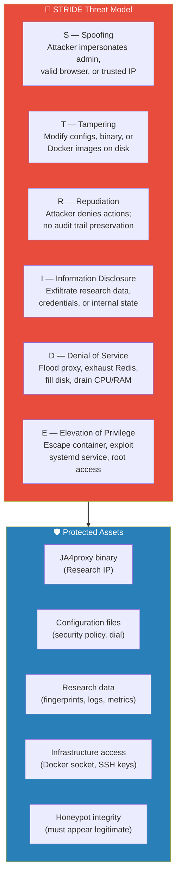

### STRIDE Analysis Matrix

| Threat | Attack Vector | Likelihood | Impact | Mitigation |
|--------|--------------|------------|--------|------------|
| **Spoofing** | Forged PROXY v2 header with trusted IP | Medium | High | Trust only 127.0.0.1 for PROXY protocol |
| **Spoofing** | SSH key theft or weak key | Low | Critical | Ed25519 keys, agent forwarding disabled |
| **Spoofing** | DNS hijacking of research domain | Medium | Medium | DNSSEC, monitoring for DNS changes |
| **Tampering** | Modify JA4proxy binary on disk | Low | Critical | File integrity monitoring (AIDE) |
| **Tampering** | Alter config to disable security | Medium | High | Immutable config via systemd ProtectSystem |
| **Tampering** | Poison Docker image via MITM | Low | Critical | Image digest pinning (SHA-256) |
| **Tampering** | Modify Redis data to bypass bans | Low | Medium | Redis AUTH + internal network only |
| **Repudiation** | Attacker claims they didn't scan | N/A | Low | Logs are evidence; tamper-evident storage |
| **Info Disclosure** | Scrape Grafana/Prometheus | Medium | Medium | UFW restricts to admin IP only |
| **Info Disclosure** | Read honeypot submissions | Low | Low | No real data exists to steal |
| **Info Disclosure** | Extract GeoIP/license keys | Low | Low | Not sensitive |
| **Info Disclosure** | Docker socket exposure | Low | Critical | Read-only mount, Promtail only |
| **DoS** | Connection flood (>10K conns/sec) | High | Medium | Tarpit + rate limiting + resource limits |
| **DoS** | Redis memory exhaustion | Medium | High | Redis maxmemory policy + limits |
| **DoS** | Disk fill via log flooding | High | Medium | Log rotation + journald size limits |
| **DoS** | TLS renegotiation attack | Low | Medium | TLS 1.2+ only, no renegotiation |
| **DoS** | Slowloris on HAProxy | Medium | Low | HAProxy timeout enforcement |
| **Elevation** | Docker container escape | Low | Critical | Read-only FS, no-new-privs, user remap |
| **Elevation** | systemd service exploit | Low | High | Full systemd security flags |
| **Elevation** | Kernel exploit from proxy | Very Low | Critical | Kernel live patching, minimal surface |

---

## 8.2 Kernel Hardening

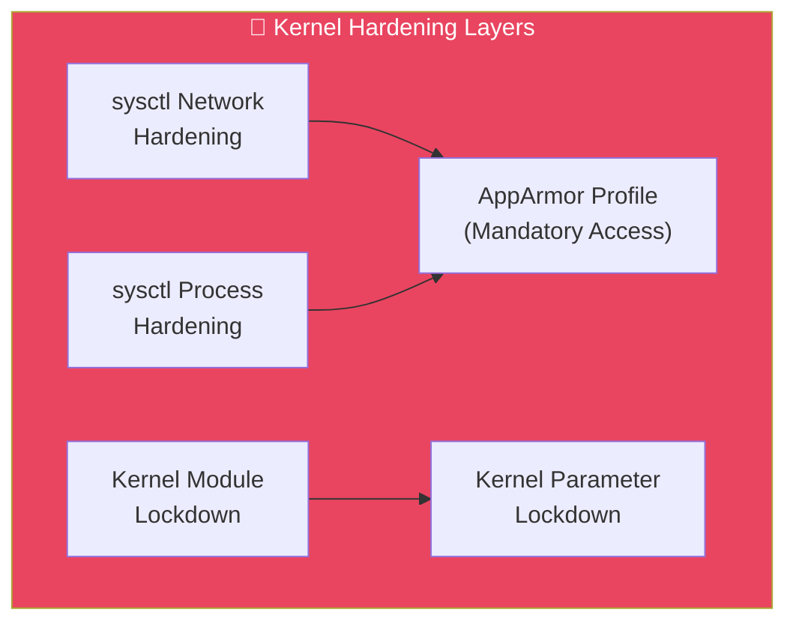

### 8.2.1 Network sysctl Hardening

```bash
# /etc/sysctl.d/99-ja4proxy-network-hardening.conf

# ── TCP/IP Stack Hardening ──
# Enable SYN cookies (protect against SYN flood)
net.ipv4.tcp_syncookies = 1

# Disable IP source routing (prevent route manipulation)
net.ipv4.conf.all.accept_source_route = 0
net.ipv4.conf.default.accept_source_route = 0

# Disable ICMP redirect acceptance (prevent MITM route changes)
net.ipv4.conf.all.accept_redirects = 0
net.ipv4.conf.default.accept_redirects = 0
net.ipv4.conf.all.send_redirects = 0
net.ipv6.conf.all.accept_redirects = 0
net.ipv6.conf.default.accept_redirects = 0

# Enable reverse path filtering (drop spoofed packets)
net.ipv4.conf.all.rp_filter = 1
net.ipv4.conf.default.rp_filter = 1

# Ignore ICMP broadcast requests (prevent Smurf attacks)
net.ipv4.icmp_echo_ignore_broadcasts = 1

# Log suspicious packets (martians, etc.)
net.ipv4.conf.all.log_martians = 1
net.ipv4.conf.default.log_martians = 1

# Disable IP forwarding (this is not a router)
net.ipv4.ip_forward = 0

# ── TCP Connection Hardening ──
# Limit SYN retries (faster half-open connection cleanup)
net.ipv4.tcp_syn_retries = 3
net.ipv4.tcp_synack_retries = 2

# Shorten TIME_WAIT for high-connection environments
net.ipv4.tcp_fin_timeout = 15
net.ipv4.tcp_tw_reuse = 1

# Limit the backlog queue (prevent queue flooding)
net.core.somaxconn = 4096
net.ipv4.tcp_max_syn_backlog = 4096

# ── Conntrack (Connection Tracking) ──
# Increase conntrack table for high connection volumes
net.netfilter.nf_conntrack_max = 262144
net.netfilter.nf_conntrack_tcp_timeout_established = 3600
net.netfilter.nf_conntrack_tcp_timeout_time_wait = 30

# ── IPv6 (Disable if not needed) ──
# net.ipv6.conf.all.disable_ipv6 = 1
# net.ipv6.conf.default.disable_ipv6 = 1

# Apply all
sudo sysctl -p /etc/sysctl.d/99-ja4proxy-network-hardening.conf
```

### 8.2.2 Process & Memory sysctl Hardening

```bash
# /etc/sysctl.d/99-ja4proxy-process-hardening.conf

# ── Kernel Access Restrictions ──
# Restrict ptrace (prevent process debugging/injection)
kernel.yama.ptrace_scope = 1

# Restrict kernel pointer exposure (hide KASLR base)
kernel.kptr_restrict = 2

# Restrict dmesg access (hide kernel messages from unpriv users)
kernel.dmesg_restrict = 1

# Disable kexec (prevent kernel replacement)
kernel.kexec_load_disabled = 1

# ── Filesystem Hardening ──
# Prevent hard links to files you don't own
fs.protected_hardlinks = 1

# Prevent symlink following in sticky directories
fs.protected_symlinks = 1

# Prevent FIFO/regular file opening in sticky dirs by non-owners
fs.protected_fifos = 2
fs.protected_regular = 2

# ── Memory Hardening ──
# Enable ASLR (Address Space Layout Randomization)
kernel.randomize_va_space = 2

# Restrict perf events (prevent side-channel attacks)
kernel.perf_event_paranoid = 3

# Limit core dumps (prevent memory exposure)
kernel.core_pattern = |/bin/false

# ── Apply all ──
sudo sysctl -p /etc/sysctl.d/99-ja4proxy-process-hardening.conf
```

### 8.2.3 AppArmor Profile for JA4proxy

```bash
# /etc/apparmor.d/opt.ja4proxy.bin.ja4proxy

#include <tunables/global>

/opt/ja4proxy/bin/ja4proxy {
  #include <abstractions/base>
  #include <abstractions/nameservice>

  # Binary itself — read-only
  /opt/ja4proxy/bin/ja4proxy mr,

  # Config — read-only
  /opt/ja4proxy/config/proxy.yml r,

  # GeoIP database — read-only
  /opt/ja4proxy/geoip/** r,

  # Logs — write only
  /opt/ja4proxy/logs/** rw,

  # PID file (if used)
  /run/ja4proxy.pid rw,

  # Network — TCP listen and connect
  network inet tcp,
  network inet6 tcp,

  # DNS resolution
  network inet dgram,
  network inet6 dgram,

  # Redis connection (local only)
  network inet stream,

  # Deny everything else
  deny /etc/shadow r,
  deny /etc/gshadow r,
  deny /etc/passwd w,
  deny /etc/group w,
  deny /root/** rw,
  deny /home/** rw,
  deny /tmp/** w,
  deny /var/tmp/** w,
  deny @{PROC}/[0-9]*/fd/ r,
  deny mount,
  deny umount,
  deny pivot_root,
  deny capability sys_admin,
  deny capability sys_ptrace,
  deny capability dac_override,
  deny capability dac_read_search,
  deny capability fowner,
  deny capability setuid,
  deny capability setgid,

  # Audit denials
  audit deny /** wl,
  audit deny /** k,
}
```

```bash
# Enable the profile
sudo apparmor_parser -r /etc/apparmor.d/opt.ja4proxy.bin.ja4proxy

# Verify it's loaded
sudo aa-status | grep ja4proxy

# Add to systemd service
# Append to the [Service] section of ja4proxy.service:
# AppArmorProfile=opt.ja4proxy.bin.ja4proxy
```

### 8.2.4 Kernel Module Lockdown

```bash
# Prevent loading kernel modules after boot
sudo cat > /etc/modprobe.d/99-ja4proxy-lockdown.conf << 'EOF'
# Lock down module loading — only allow modules needed for networking
install dccp /bin/false
install sctp /bin/false
install rds /bin/false
install tipc /bin/false
install n-hdlc /bin/false
install ax25 /bin/false
install netrom /bin/false
install x25 /bin/false
install rose /bin/false
install decnet /bin/false
install econet /bin/false
install af_802154 /bin/false
install ipx /bin/false
install appletalk /bin/false
install psnap /bin/false
install p8023 /bin/false
install p8022 /bin/false
EOF

# Lock down the module loading
sudo chmod 600 /etc/modprobe.d/99-ja4proxy-lockdown.conf

# Also lock /proc/sysrq
echo "kernel.sysrq = 0" | sudo tee -a /etc/sysctl.d/99-ja4proxy-process-hardening.conf
```

---

## 8.3 Container Security Deep Hardening

```mermaid
flowchart TD
    subgraph ContainerSec["🐳 Container Security Stack"]
        subgraph Build["📦 Image Security"]
            I1["Pin image SHA-256\ndigests (not tags)"]
            I2["Verify image provenance\n(cosign/Sigstore if available)"]
            I3["Scan images before\ndeploy (trivy/snyk)"]
            I4["Use minimal base images\n(alpine, distroless)"]
        end

        subgraph Runtime["🔒 Runtime Security"]
            R1["Read-only root FS\n(tmpfs for /tmp, /var)"]
            R2["Drop ALL capabilities\n(add back minimum)"]
            R3["No-new-privileges\nflag enforced"]
            R4["User namespace remapping\n(host root ≠ container root)"]
            R5["Seccomp profiles\n(syscall filtering)"]
            R6["Resource limits\n(CPU, memory, PIDs)"]
            R7["No privileged\ncontainers ever"]
        end

        subgraph Network["🌐 Container Network"]
            N1["Internal networks\n(no internet for Redis,\nCaddy, Loki)"]
            N2["Inter-container\nisolation (icc=false)"]
            N3["No published ports\nexcept essential\n(443, 80, admin)"]
            N4["Docker socket\nread-only for\nPromtail only"]
        end

        Build --> Runtime --> Network

        style Build fill:#2980b9,color:#fff
        style Runtime fill:#e74c3c,color:#fff
        style Network fill:#f39c12,color:#fff
    end
```

### 8.3.1 Pinned Image Digests

Replace all `image: tag` references with pinned SHA-256 digests. This prevents supply chain attacks via tag mutation:

```bash
# Get current digests (run on a trusted machine)
docker pull haproxy:2.8-alpine && docker inspect --format='{{index .RepoDigests 0}}' haproxy:2.8-alpine
docker pull redis:7-alpine && docker inspect --format='{{index .RepoDigests 0}}' redis:7-alpine
docker pull caddy:2-alpine && docker inspect --format='{{index .RepoDigests 0}}' caddy:2-alpine
docker pull prom/prometheus:latest && docker inspect --format='{{index .RepoDigests 0}}' prom/prometheus:latest
docker pull grafana/grafana:latest && docker inspect --format='{{index .RepoDigests 0}}' grafana/grafana:latest
docker pull grafana/loki:latest && docker inspect --format='{{index .RepoDigests 0}}' grafana/loki:latest
docker pull grafana/promtail:latest && docker inspect --format='{{index .RepoDigests 0}}' grafana/promtail:latest
```

Update `docker-compose.yml` with pinned digests:

```yaml
services:
  haproxy:
    image: haproxy@sha256:abcd1234...  # Pin actual digest
  redis:
    image: redis@sha256:efgh5678...    # Pin actual digest
  caddy:
    image: caddy@sha256:ijkl9012...    # Pin actual digest
  # ... etc
```

> **Note**: Record digests in a `image-digests.txt` file during Phase 2 artifact preparation. Update digests quarterly or when security advisories affect any image.

### 8.3.2 Seccomp Profiles

Create a custom seccomp profile for the JA4proxy binary (if running in Docker — for systemd, AppArmor covers this):

```json
{
  "defaultAction": "SCMP_ACT_ERRNO",
  "architectures": ["SCMP_ARCH_X86_64", "SCMP_ARCH_X86", "SCMP_ARCH_X32"],
  "syscalls": [
    {
      "names": [
        "accept4", "access", "arch_prctl", "bind", "brk",
        "clock_gettime", "clone", "close", "connect",
        "epoll_create1", "epoll_ctl", "epoll_pwait", "epoll_wait",
        "eventfd2", "execve", "exit", "exit_group",
        "fcntl", "fstat", "futex", "getdents64", "getpeername",
        "getpid", "getrandom", "getsockname", "getsockopt",
        "gettid", "gettimeofday", "listen", "lseek", "madvise",
        "mmap", "mprotect", "mremap", "munmap", "nanosleep",
        "newfstatat", "openat", "prctl", "pread64", "pwrite64",
        "read", "readv", "recvfrom", "recvmsg", "rt_sigaction",
        "rt_sigprocmask", "rt_sigreturn", "sched_getaffinity",
        "sched_yield", "select", "sendfile", "sendmsg", "sendto",
        "set_robust_list", "set_tid_address", "setsockopt",
        "setitimer", "shutdown", "sigaltstack", "socket",
        "socketpair", "statx", "tgkill", "write", "writev"
      ],
      "action": "SCMP_ACT_ALLOW"
    }
  ]
}
```

### 8.3.3 Container Compose Security Overrides

Add these to EVERY service in `docker-compose.yml`:

```yaml
services:
  # Example applied to Redis — apply same pattern to all services
  redis:
    image: redis@sha256:...
    security_opt:
      - no-new-privileges:true
    read_only: true
    tmpfs:
      - /tmp:noexec,nosuid,size=64m
      - /var/run/redis:noexec,nosuid,size=64m
    cap_drop:
      - ALL
    cap_add: []
    user: "999:999"  # Redis user (verify with docker inspect)
    deploy:
      resources:
        limits:
          memory: 256M
          cpus: "0.25"
          pids: 64
    ulimits:
      nofile:
        soft: 1024
        hard: 1024
      nproc:
        soft: 64
        hard: 64
    healthcheck:
      test: ["CMD", "redis-cli", "-a", "${REDIS_PASSWORD}", "ping"]
      interval: 10s
      timeout: 5s
      retries: 3
      start_period: 5s
    stop_grace_period: 10s
    restart: unless-stopped
```

### 8.3.4 Docker Daemon Hardening (Supplemental)

```bash
# /etc/docker/daemon.json — enhanced
{
  "icc": false,
  "log-driver": "json-file",
  "log-opts": {
    "max-size": "100m",
    "max-file": "3"
  },
  "no-new-privileges": true,
  "userns-remap": "default",
  "live-restore": false,
  "default-ulimits": {
    "nofile": {
      "Name": "nofile",
      "Hard": 32768,
      "Soft": 32768
    }
  },
  "features": {
    "containerd-snapshotter": false
  }
}
```

---

## 8.4 Network Security Architecture

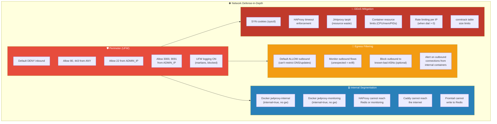

### 8.4.1 Egress Monitoring

```bash
# Install iptables-based egress logging
sudo iptables -A OUTPUT -o eth0 -j LOG --log-prefix "EGRESS: " --log-level 4
sudo iptables -A OUTPUT -o eth0 -m limit --limit 100/minute -j ACCEPT

# Log egress to dedicated file
sudo cat > /etc/rsyslog.d/10-egress.conf << 'EOF'
:msg, contains, "EGRESS:" /var/log/egress.log
& stop
EOF

sudo systemctl restart rsyslog

# Monitor egress (run periodically)
sudo grep "EGRESS:" /var/log/egress.log | \
  awk '{print $10}' | sort | uniq -c | sort -rn | head -20
```

### 8.4.2 Internal Network Verification

```bash
# Verify internal networks cannot reach internet
docker exec ja4proxy-redis wget -T5 http://example.com 2>&1
# Expected: "wget: bad address" or "Connection refused"

docker exec ja4proxy-honeypot curl -s --max-time 5 http://example.com 2>&1
# Expected: "Could not resolve host" or timeout

docker exec ja4proxy-loki curl -s --max-time 5 http://example.com:443 2>&1
# Expected: timeout or connection error

# Verify containers can ONLY talk to their intended peers
# Redis → only accessible from host (JA4proxy binary)
docker exec ja4proxy-redis redis-cli -h 127.0.0.1 ping
# Should fail (Redis binds to 0.0.0.0 but internal network)

# HAProxy → only JA4proxy:8080 and Caddy:8081
docker exec ja4proxy-haproxy nc -z ja4proxy 8080 && echo "OK" || echo "FAIL"
```

### 8.4.3 TCP Wrappers & Host-Level Controls

```bash
# /etc/hosts.deny — deny everything by default
echo "ALL: ALL" | sudo tee /etc/hosts.deny

# /etc/hosts.allow — allow only localhost and admin
sudo cat > /etc/hosts.allow << EOF
sshd: $(cat /etc/ssh/sshd_config | grep -oP 'AllowUsers.*' | awk '{print $2}')
ALL: 127.0.0.1
ALL: ::1
EOF
```

---

## 8.5 Supply Chain Security

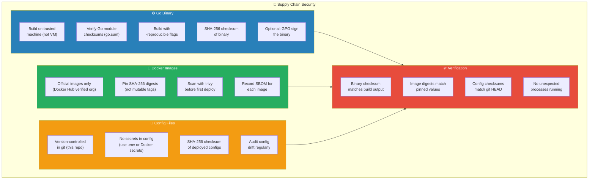

### 8.5.1 Reproducible Go Builds

```bash
# On the trusted build machine
cd JA4proxy

# Clean module cache for reproducibility
go clean -modcache
go mod download
go mod verify  # Verifies go.sum checksums

# Build with reproducible flags
CGO_ENABLED=0 GOOS=linux GOARCH=amd64 \
  go build -trimpath -ldflags="-s -w -buildid=" \
  -o bin/ja4proxy ./cmd/proxy

# -trimpath: Remove local filesystem paths from binary
# -s -w: Strip debug info (smaller binary, less info leakage)
# -buildid=: Remove build ID (reproducible builds)

# Generate checksums
sha256sum bin/ja4proxy > bin/ja4proxy.sha256
sha256sum -c bin/ja4proxy.sha256

# Optional: GPG sign
gpg --detach-sign --armor bin/ja4proxy.sha256
# This produces bin/ja4proxy.sha256.asc
```

### 8.5.2 Image Vulnerability Scanning

```bash
# Install trivy on the build machine
# curl -sfL https://raw.githubusercontent.com/aquasecurity/trivy/main/contrib/install.sh | sh -s -- -b /usr/local/bin

# Scan all images before deployment
trivy image --severity HIGH,CRITICAL haproxy:2.8-alpine
trivy image --severity HIGH,CRITICAL redis:7-alpine
trivy image --severity HIGH,CRITICAL caddy:2-alpine
trivy image --severity HIGH,CRITICAL prom/prometheus:latest
trivy image --severity HIGH,CRITICAL grafana/grafana:latest
trivy image --severity HIGH,CRITICAL grafana/loki:latest
trivy image --severity HIGH,CRITICAL grafana/promtail:latest

# Generate SBOM
trivy image --format spdx-json -o sbom-haproxy.json haproxy:2.8-alpine
trivy image --format spdx-json -o sbom-redis.json redis:7-alpine

# Save scan results
mkdir -p docs/phases/security-artifacts/
trivy image --format table -o docs/phases/security-artifacts/trivy-report.md \
  haproxy:2.8-alpine redis:7-alpine caddy:2-alpine prom/prometheus:latest \
  grafana/grafana:latest grafana/loki:latest grafana/promtail:latest
```

### 8.5.3 Deployment Checksum Verification Script

Create this script to run on the VM after artifact transfer:

```bash
#!/bin/bash
# /opt/ja4proxy/scripts/verify-artifacts.sh
set -euo pipefail

echo "=== Artifact Integrity Verification ==="
echo ""

# Verify Go binary
echo "[1/4] Verifying JA4proxy binary..."
EXPECTED_SHA=$(cat /home/adminuser/ja4proxy.sha256 | awk '{print $1}')
ACTUAL_SHA=$(sha256sum /opt/ja4proxy/bin/ja4proxy | awk '{print $1}')
if [ "$EXPECTED_SHA" = "$ACTUAL_SHA" ]; then
    echo "  ✅ Binary checksum matches"
else
    echo "  ❌ BINARY CHECKSUM MISMATCH — POSSIBLE TAMPERING"
    echo "     Expected: $EXPECTED_SHA"
    echo "     Actual:   $ACTUAL_SHA"
    exit 1
fi

# Verify config files
echo "[2/4] Verifying config files..."
for f in /opt/ja4proxy/config/proxy.yml /opt/ja4proxy-docker/.env \
         /opt/ja4proxy-docker/docker-compose.yml; do
    if [ -f "$f" ]; then
        echo "  ✅ $f exists ($(stat -c%s "$f") bytes)"
    else
        echo "  ❌ $f MISSING"
        exit 1
    fi
done

# Verify Docker images match pinned digests (if using digests)
echo "[3/4] Verifying Docker image digests..."
cd /opt/ja4proxy-docker
EXPECTED_DIGESTS=$(grep 'image:.*sha256:' docker-compose.yml | sed 's/.*image: //')
for digest in $EXPECTED_DIGESTS; do
    if docker images --digests --format '{{.Digest}}' | grep -q "$digest"; then
        echo "  ✅ Image with digest $digest is present"
    else
        echo "  ⚠️ Image digest $digest not found (may not be pulled yet)"
    fi
done

# Verify no unexpected processes
echo "[4/4] Checking running processes..."
UNEXPECTED=$(ps aux --no-headers | grep -vE 'ja4proxy|docker|containerd|systemd|sshd|ufw|fail2ban|rsyslog|cron|apt|ps|grep' | grep -v '^\s*root\s' | wc -l)
if [ "$UNEXPECTED" -eq 0 ]; then
    echo "  ✅ No unexpected processes"
else
    echo "  ⚠️ $UNEXPECTED unexpected process(es) detected"
    ps aux | grep -vE 'ja4proxy|docker|containerd|systemd|sshd|ufw|fail2ban|rsyslog|cron|apt|ps|grep'
fi

echo ""
echo "=== Verification Complete ==="
```

---

## 8.6 File Integrity Monitoring (AIDE)

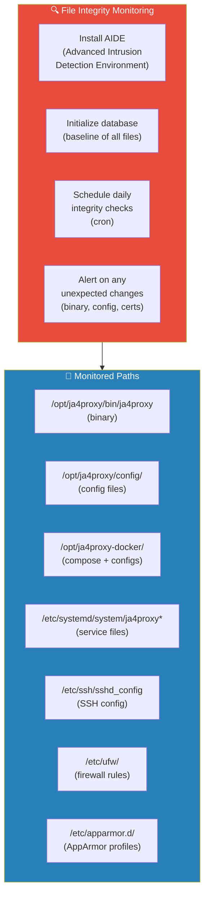

### 8.6.1 AIDE Setup

```bash
# Install AIDE
sudo apt install -y aide

# Configure monitored paths
sudo cat > /etc/aide/aide.conf.d/99_ja4proxy << 'EOF'
# JA4proxy binary — strict monitoring (all attributes)
/opt/ja4proxy/bin/ja4proxy    p+i+l+n+u+g+s+b+m+c+sha256

# JA4proxy configs — content monitoring
/opt/ja4proxy/config/    p+i+l+n+u+g+s+b+m+c+sha256

# Docker compose and configs
/opt/ja4proxy-docker/    p+i+l+n+u+g+s+b+m+c+sha256

# Service files
/etc/systemd/system/ja4proxy.service    p+i+l+n+u+g+s+b+m+c+sha256
/etc/systemd/system/ja4proxy-redis.service    p+i+l+n+u+g+s+b+m+c+sha256

# SSH config
/etc/ssh/sshd_config    p+i+l+n+u+g+s+b+m+c+sha256
/etc/ssh/sshd_config.d/    p+i+l+n+u+g+s+b+m+c+sha256

# Firewall
/etc/ufw/    p+i+l+n+u+g+s+b+m+c+sha256

# AppArmor profiles
/etc/apparmor.d/opt.ja4proxy.bin.ja4proxy    p+i+l+n+u+g+s+b+m+c+sha256

# Exclude transient files
!/opt/ja4proxy/logs/
!/opt/ja4proxy-docker/caddy-data/
!/opt/ja4proxy-docker/prometheus-data/
!/opt/ja4proxy-docker/loki-data/
!/opt/ja4proxy-docker/grafana-data/
EOF

# Initialize the baseline database
sudo aideinit
sudo mv /var/lib/aide/aide.db.new /var/lib/aide/aide.db

# Schedule daily checks
sudo cat > /etc/cron.daily/aide-ja4proxy << 'EOF'
#!/bin/bash
/usr/bin/aide --check 2>&1 | mail -s "AIDE Integrity Check: $(hostname)" admin@example.com
EOF
sudo chmod 755 /etc/cron.daily/aide-ja4proxy

# Run first check to verify
sudo aide --check
```

### 8.6.2 Updating the Baseline

```bash
# After legitimate config changes (e.g., dial increase):
sudo aide --update
sudo mv /var/lib/aide/aide.db.new /var/lib/aide/aide.db
echo "Baseline updated at $(date)" | sudo tee /var/log/aide-baseline-updates.log
```

---

## 8.7 Forensic Readiness

```mermaid
flowchart TD
    subgraph Forensics["🔬 Forensic Readiness"]
        subgraph Evidence["📋 Evidence Types"]
            E1["JA4proxy journal logs\n(connection forensic data)"]
            E2["HAProxy access logs\n(TCP connection records)"]
            E3["Caddy access logs\n(honeypot interaction data)"]
            E4["UFW block logs\n(scan attempt records)"]
            E5["Fail2ban logs\n(ban/unban records)"]
            E6["Prometheus metrics\n(time-series behavioral data)"]
            E7["AIDE reports\n(file change records)"]
        end

        subgraph Preservation["💾 Evidence Preservation"]
            P1["Centralized logging\n(Loki) — survives\nindividual service failure"]
            P2["Periodic export to\nadmin machine (offline\nstorage)"]
            P3["Write-protected\nsnapshots on incident"]
            P4["Chain of custody\ndocumentation"]
        end

        subgraph Response["🚨 Incident Forensics"]
            R1["Memory dump\n(if compromise suspected)"]
            R2["Disk image\n(for full forensic analysis)"]
            R3["Network capture\n(tcpdump on incident)"]
            R4["Timeline reconstruction\n(log correlation)"]
        end

        Evidence --> Preservation
        Preservation --> Response

        style Evidence fill:#2980b9,color:#fff
        style Preservation fill:#f39c12,color:#fff
        style Response fill:#e74c3c,color:#fff
    end
```

### 8.7.1 Automated Evidence Collection

```bash
#!/bin/bash
# /opt/ja4proxy/scripts/forensic-snapshot.sh
# Run on-demand or on a timer. Creates a read-only evidence package.

TIMESTAMP=$(date +%Y%m%d_%H%M%S)
EVIDENCE_DIR="/tmp/forensic-${TIMESTAMP}"
mkdir -p "$EVIDENCE_DIR"/{logs,config,processes,network,services,containers}

echo "=== Forensic Snapshot: $TIMESTAMP ==="

# System logs
journalctl --since "7 days ago" --no-pager > "$EVIDENCE_DIR/logs/journal-all.log"
journalctl -u ja4proxy.service --since "7 days ago" --no-pager > "$EVIDENCE_DIR/logs/ja4proxy.log"
journalctl -u fail2ban.service --since "7 days ago" --no-pager > "$EVIDENCE_DIR/logs/fail2ban.log"

# UFW logs
grep "UFW BLOCK" /var/log/ufw.log 2>/dev/null > "$EVIDENCE_DIR/logs/ufw-block.log" || true

# Docker logs
docker compose -f /opt/ja4proxy-docker/docker-compose.yml logs --since=7d > "$EVIDENCE_DIR/logs/docker-all.log" 2>&1

# Configuration snapshot
cp /opt/ja4proxy/config/proxy.yml "$EVIDENCE_DIR/config/"
cp /opt/ja4proxy-docker/.env "$EVIDENCE_DIR/config/"
cp /opt/ja4proxy-docker/docker-compose.yml "$EVIDENCE_DIR/config/"
cp /etc/ssh/sshd_config "$EVIDENCE_DIR/config/"
sudo ufw status verbose > "$EVIDENCE_DIR/config/ufw-status.txt"
sudo iptables -L -n -v > "$EVIDENCE_DIR/config/iptables.txt"

# Process and memory state
ps auxf > "$EVIDENCE_DIR/processes/ps-tree.txt"
ss -tlnp > "$EVIDENCE_DIR/network/listening-ports.txt"
ss -tnp state established > "$EVIDENCE_DIR/network/established-connections.txt"
netstat -rn > "$EVIDENCE_DIR/network/routing-table.txt"

# systemd state
systemctl list-units --state=failed > "$EVIDENCE_DIR/services/failed-services.txt"
systemctl status ja4proxy > "$EVIDENCE_DIR/services/ja4proxy-status.txt"

# Docker state
docker ps -a > "$EVIDENCE_DIR/containers/container-state.txt"
docker images > "$EVIDENCE_DIR/containers/image-list.txt"
docker stats --no-stream > "$EVIDENCE_DIR/containers/resource-usage.txt"

# Binary checksum
sha256sum /opt/ja4proxy/bin/ja4proxy > "$EVIDENCE_DIR/binary-checksum.txt"

# AIDE status (if installed)
aide --check > "$EVIDENCE_DIR/aide-check.log" 2>&1 || true

# Compress and make read-only
tar czf "$EVIDENCE_DIR.tar.gz" -C /tmp "forensic-${TIMESTAMP}"
rm -rf "$EVIDENCE_DIR"

# Make evidence package read-only
chmod 444 "$EVIDENCE_DIR.tar.gz"

echo "Evidence package: $EVIDENCE_DIR.tar.gz"
echo "SHA-256: $(sha256sum "$EVIDENCE_DIR.tar.gz")"
echo "Size: $(du -h "$EVIDENCE_DIR.tar.gz" | cut -f1)"

# Copy to admin machine (if network available)
# scp "$EVIDENCE_DIR.tar.gz" admin@<ADMIN_MACHINE>:/evidence/
```

### 8.7.2 Incident Response Playbook

```bash
#!/bin/bash
# /opt/ja4proxy/scripts/incident-response.sh
# Execute IMMEDIATELY upon suspected compromise

echo "⚠️ INCIDENT RESPONSE INITIATED: $(date -u +%Y-%m-%dT%H:%M:%SZ)"

# Step 1: Preserve evidence BEFORE anything else
/opt/ja4proxy/scripts/forensic-snapshot.sh

# Step 2: Capture live network traffic (if still running)
sudo tcpdump -i any -w /tmp/incident-traffic.pcap -c 10000 &
TCPDUMP_PID=$!

# Step 3: Capture memory state (if LiME available)
# sudo insmod /opt/lime.ko path=/tmp/memory-dump format=raw

# Step 4: Isolate network (disable firewall except SSH)
sudo ufw --force reset
sudo ufw default deny incoming
sudo ufw default deny outgoing
sudo ufw allow from <ADMIN_IP> to any port 22 proto tcp
sudo ufw --force enable

echo "✅ Network isolated — only SSH from admin IP allowed"

# Step 5: Stop non-essential services (preserve evidence)
# sudo systemctl stop ja4proxy
# docker compose -f /opt/ja4proxy-docker/docker-compose.yml stop

# Step 6: Notify
echo "INCIDENT on $(hostname) at $(date -u). Isolated. Evidence preserved." | \
  mail -s "SECURITY INCIDENT: $(hostname)" admin@example.com

echo "📋 Incident response complete. Manual investigation required."
echo "   Evidence: /tmp/forensic-*.tar.gz"
echo "   Network capture: /tmp/incident-traffic.pcap (PID: $TCPDUMP_PID)"
```

---

## 8.8 Honeypot Anti-Detection & Deception

```mermaid
flowchart TD
    subgraph AntiDetect["🎭 Anti-Detection Strategy"]
        subgraph Appearance["👤 Appear Legitimate"]
            A1["Valid TLS certificate\n(Let's Encrypt via Caddy)"]
            A2["Standard HTTP headers\n(Server, Content-Type)"]
            A3["Common web technologies\n(JS, CSS, form elements)"]
            A4["robots.txt present\n(but bots ignore it)"]
            A5["favicon.ico served\n(common browser request)"]
        end

        subgraph Deception["🪥 Deception Techniques"]
            D1["Fingerpainting: serve\ndifferent content to\nknown scanners"]
            D2["Slow responses for\nsuspicious fingerprints\n(2-5 second delay)"]
            D3["Fake technology\nstack indicators\n(Apache headers, PHP cookies)"]
            D4["Hidden honeypot fields\n(form fields only bots fill)"]
            D5["JavaScript challenges\n(real browsers execute,\nbots may not)"]
        end

        subgraph Detection["🔍 Bot Detection via\nHoneypot Behavior"]
            E1["Form submitted in <1s\n= automated"]
            E2["Hidden field filled\n= automated"]
            E3["No JS execution\n(no session cookie)"]
            E4["Non-standard form\nencoding/headers"]
            E5["Known bot UA strings"]
        end

        Appearance --> Deception --> Detection

        style Appearance fill:#27ae60,color:#fff
        style Deception fill:#f39c12,color:#fff
        style Detection fill:#e74c3c,color:#fff
    end
```

### 8.8.1 Enhanced Honeypot HTML

```html
<!-- /opt/ja4proxy-docker/config/caddy/html/index.html — Enhanced -->
<!DOCTYPE html>
<html lang="en">
<head>
    <meta charset="UTF-8">
    <meta name="viewport" content="width=device-width, initial-scale=1.0">
    <title>Welcome to Example Research Portal</title>
    <!-- Normal-looking meta to appear legitimate -->
    <meta name="description" content="Research portal for academic studies">
    <meta name="robots" content="index, follow">
    <!-- Fake technology stack indicators -->
    <meta name="generator" content="WordPress 6.4.2">
    <link rel="stylesheet" href="/assets/style.css">
    <link rel="icon" href="/favicon.ico" type="image/x-icon">
</head>
<body>
    <!-- Hidden honeypot fields — bots fill these, humans don't see them -->
    <div style="position:absolute;left:-9999px;top:-9999px;visibility:hidden;" aria-hidden="true">
        <form id="decoy-form">
            <input type="text" name="website" id="website-field" tabindex="-1" autocomplete="off">
            <input type="hidden" name="honeypot_token" value="">
            <textarea name="bio" id="bio-field" tabindex="-1"></textarea>
        </form>
    </div>

    <!-- Visible content — warnings for legitimate humans -->
    <div class="warning-banner" id="warning-banner">
        <h1>⚠️ RESEARCH HONEYPOT — DO NOT SUBMIT REAL DATA</h1>
        <p>This server is a research environment for TLS fingerprinting analysis.</p>
        <p>No real data is collected. All submissions are logged and discarded.</p>
        <p><small>If you reached this page accidentally, please close your browser.</small></p>
    </div>

    <div class="content">
        <h2>Academic Research Portal</h2>
        <p>Welcome to our research data collection platform. Please fill out the
        form below to participate in our study.</p>

        <form id="research-form" method="POST" action="/submit">
            <!-- Bot detection: measure time from page load to submit -->
            <input type="hidden" name="page_load_time" id="page-load-time">
            <input type="hidden" name="form_submit_time" id="form-submit-time">
            <input type="hidden" name="js_enabled" id="js-enabled" value="false">
            <input type="hidden" name="mouse_movements" id="mouse-movements" value="0">

            <label for="name">Name (use fake data only):</label>
            <input type="text" name="name" id="name" required autocomplete="off"
                   placeholder="Enter a fake name">

            <label for="email">Email (use fake data only):</label>
            <input type="email" name="email" id="email" required autocomplete="off"
                   placeholder="fake@example.com">

            <label for="interest">Research Interest:</label>
            <select name="interest" id="interest">
                <option value="">Select an option</option>
                <option value="network-security">Network Security</option>
                <option value="tls-analysis">TLS Analysis</option>
                <option value="bot-detection">Bot Detection</option>
            </select>

            <label for="message">Message (use fake data only):</label>
            <textarea name="message" id="message" rows="4"
                      placeholder="Enter a fake message for the research study"></textarea>

            <!-- Bot detection checkbox -->
            <div class="human-check">
                <label>
                    <input type="checkbox" name="human_check" id="human-check">
                    I confirm I am submitting fake research data
                </label>
            </div>

            <button type="submit" id="submit-btn">Submit Research Data</button>
        </form>
    </div>

    <footer>
        <p>&copy; 2025 Research Portal — Contact: research@example.com</p>
        <p><small>This is a test environment. <a href="/about">About</a> |
        <a href="/privacy">Privacy</a> | <a href="/terms">Terms</a></small></p>
    </footer>

    <script>
        // Bot detection scripts — real browsers execute these
        document.getElementById('js-enabled').value = 'true';
        document.getElementById('page-load-time').value = Date.now();

        let mouseCount = 0;
        document.addEventListener('mousemove', function() {
            mouseCount++;
            document.getElementById('mouse-movements').value = mouseCount;
        });

        document.getElementById('research-form').addEventListener('submit', function() {
            document.getElementById('form-submit-time').value = Date.now();
        });
    </script>
</body>
</html>
```

### 8.8.2 Enhanced Caddy Backend (Form Analysis)

```caddyfile
# /opt/ja4proxy-docker/config/caddy/Caddyfile — Enhanced

{
    admin off
    auto_https off
}

:8081 {
    log {
        output stdout
        format json
    }

    root * /srv
    file_server

    # Bot trap: hidden field submission
    @bot_trap path /submit method POST
    handle @bot_trap {
        request_body {
            max_size 1MB
        }

        # Log all form fields for bot analysis
        respond "Submission received.\n" 200 {
            close
        }
    }

    # Serve fake technology stack indicators
    @assets path /assets/*
    handle @assets {
        respond "/* stylesheet placeholder */\n" 200
    }

    @favicon path /favicon.ico
    handle @favicon {
        respond "" 200
    }

    @robots path /robots.txt
    handle @robots {
        respond "User-agent: *\nAllow: /\n" 200
    }

    @sitemap path /sitemap.xml
    handle @sitemap {
        respond "<?xml version=\"1.0\"?><urlset xmlns=\"http://www.sitemaps.org/schemas/sitemap/0.9\"><url><loc>https://test.example.com/</loc></url></urlset>" 200 {
            header Content-Type "application/xml"
        }
    }

    # Catch-all for other paths
    handle {
        respond "Not found\n" 404
    }

    encode gzip
}
```

### 8.8.3 Submission Analysis Script

```bash
#!/bin/bash
# /opt/ja4proxy-docker/scripts/analyze-submissions.sh
# Run hourly to analyze honeypot form submissions for bot behavior

echo "=== Honeypot Submission Analysis ==="
echo ""

# Get recent submissions from Caddy logs
echo "Recent form submissions (last 24h):"
docker logs ja4proxy-honeypot --since 24h 2>&1 | \
  grep "POST /submit" | \
  jq -c 'select(.request != null) | {time: .ts, ip: .request.remote_ip, ua: .request.headers.User_agent, method: .request.method}' | \
  while read -r line; do
    echo "  $line"

    # Analyze submission timing
    # Bots typically submit < 1 second after page load
    # Humans take > 10 seconds

    # Check for hidden field population
    # Bots fill hidden fields, humans don't see them
  done

echo ""
echo "Submission rate (last 24h):"
docker logs ja4proxy-honeypot --since 24h 2>&1 | \
  grep -c "POST /submit"

echo ""
echo "Unique IPs submitting:"
docker logs ja4proxy-honeypot --since 24h 2>&1 | \
  grep "POST /submit" | \
  jq -r 'select(.request != null) | .request.remote_ip' 2>/dev/null | \
  sort -u | wc -l

echo ""
echo "User agents from submissions:"
docker logs ja4proxy-honeypot --since 24h 2>&1 | \
  grep "POST /submit" | \
  jq -r 'select(.request != null) | .request.headers.User_agent[0]' 2>/dev/null | \
  sort | uniq -c | sort -rn | head -10
```

---

## 8.9 Log Security & Sanitization

```mermaid
flowchart TD
    subgraph LogSec["📋 Log Security"]
        subgraph Protection["🛡️ Log Protection"]
            P1["No secrets in logs\n(credentials, keys, tokens)"]
            P2["No PII in logs\n(form submissions discarded)"]
            P3["Structured logging\n(JSON format for parsing)"]
            P4["Log rotation enforced\n(disk exhaustion prevention)"]
            P5["Log integrity monitoring\n(AIDE watches log files)"]
        end

        subgraph Sanitize["🧹 Log Sanitization"]
            S1["Redact IP addresses\nin exported reports\n(optional, for privacy)"]
            S2["Strip TLS cert\ncontents from logs\n(keep fingerprint only)"]
            S3["Remove query strings\nand form body content\nfrom access logs"]
            S4["Normalize timestamps\nto UTC ISO-8601"]
        end

        subgraph Export["📤 Secure Export"]
            E1["Export via SSH tunnel\n(encrypted channel)"]
            E2["Compress + encrypt\nexport packages"]
            E3["Delete local copy\nafter successful export"]
            E4["Verify export integrity\n(checksum match)"]
        end

        Protection --> Sanitize --> Export

        style Protection fill:#27ae60,color:#fff
        style Sanitize fill:#f39c12,color:#fff
        style Export fill:#e74c3c,color:#fff
    end
```

### 8.9.1 Log Configuration Hardening

```bash
# journald configuration — prevent disk exhaustion
sudo cat > /etc/systemd/journald.conf.d/99-ja4proxy.conf << 'EOF'
[Journal]
# Maximum disk usage
MaxUse=2G
SystemMaxUse=2G
# Retention period
MaxRetentionSec=90d
# Forward to rsyslog for additional processing
ForwardToSyslog=yes
# Compress logs
Compress=yes
# Sync interval (balance performance vs. data loss)
SyncIntervalSec=5s
# Rate limiting (prevent log flooding)
RateLimitIntervalSec=30s
RateLimitBurst=10000
EOF

sudo systemctl restart systemd-journald

# Rsyslog configuration — separate log streams
sudo cat > /etc/rsyslog.d/10-ja4proxy.conf << 'EOF'
# JA4proxy logs to dedicated file
:programname, isequal, "ja4proxy" /var/log/ja4proxy/ja4proxy.log
:programname, isequal, "ja4proxy" ~

# UFW block logs to dedicated file
:msg, contains, "UFW BLOCK" /var/log/ufw-block.log
:msg, contains, "UFW BLOCK" ~

# Fail2ban logs
:programname, isequal, "fail2ban" /var/log/fail2ban.log
:programname, isequal, "fail2ban" ~
EOF

sudo mkdir -p /var/log/ja4proxy
sudo chown syslog:adm /var/log/ja4proxy
sudo systemctl restart rsyslog

# Logrotate configuration
sudo cat > /etc/logrotate.d/ja4proxy << 'EOF'
/var/log/ja4proxy/*.log
/var/log/ufw-block.log
/var/log/fail2ban.log
{
    rotate 90
    daily
    compress
    delaycompress
    missingok
    notifempty
    create 0640 root adm
    sharedscripts
    postrotate
        systemctl restart rsyslog > /dev/null 2>&1 || true
    endscript
}
EOF
```

### 8.9.2 Secure Log Export

```bash
#!/bin/bash
# /opt/ja4proxy/scripts/secure-export-logs.sh
# Export logs securely to admin machine

set -euo pipefail

TIMESTAMP=$(date +%Y%m%d_%H%M%S)
EXPORT_DIR="/tmp/log-export-${TIMESTAMP}"
mkdir -p "$EXPORT_DIR"

echo "=== Secure Log Export ==="

# Collect logs
journalctl --since "7 days ago" --no-pager > "$EXPORT_DIR/journal.log"
cp -r /var/log/ja4proxy/ "$EXPORT_DIR/" 2>/dev/null || true
cp /var/log/ufw-block.log "$EXPORT_DIR/" 2>/dev/null || true
cp /var/log/fail2ban.log "$EXPORT_DIR/" 2>/dev/null || true
docker compose -f /opt/ja4proxy-docker/docker-compose.yml logs --since=7d > "$EXPORT_DIR/docker-logs.log" 2>&1

# Create checksums
cd "$EXPORT_DIR"
sha256sum * > checksums.sha256

# Compress
cd /tmp
tar czf "log-export-${TIMESTAMP}.tar.gz" "log-export-${TIMESTAMP}/"

# Encrypt with admin's GPG key (if available)
if gpg --list-keys admin@example.com >/dev/null 2>&1; then
    gpg --encrypt --recipient admin@example.com "log-export-${TIMESTAMP}.tar.gz"
    EXPORT_FILE="log-export-${TIMESTAMP}.tar.gz.gpg"
    echo "🔒 Encrypted with GPG"
else
    EXPORT_FILE="log-export-${TIMESTAMP}.tar.gz"
    echo "⚠️ GPG key not found — export is unencrypted"
fi

echo "📦 Export: /tmp/$EXPORT_FILE"
echo "🔑 Checksum: $(sha256sum "/tmp/$EXPORT_FILE" | awk '{print $1}')"

# Clean up plaintext
rm -rf "$EXPORT_DIR"
rm -f "/tmp/log-export-${TIMESTAMP}.tar.gz"

echo "✅ Export complete. Transfer to admin machine via SCP."
```

---

## 8.10 DNS Security

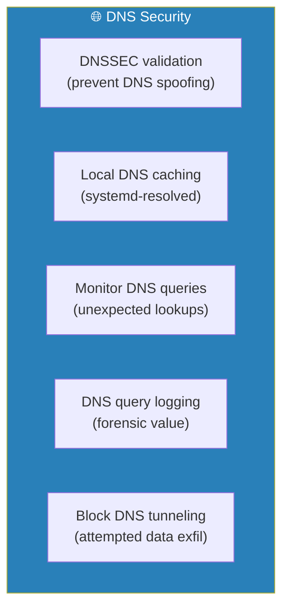

### 8.10.1 DNSSEC & Local Resolver

```bash
# Enable DNSSEC validation in systemd-resolved
sudo cat > /etc/systemd/resolved.conf.d/99-dnssec.conf << 'EOF'
[Resolve]
DNSSEC=allow-downgrade
DNSOverTLS=opportunistic
FallbackDNS=1.1.1.1 8.8.8.8
Cache=yes
CacheSize=50M
EOF

sudo systemctl restart systemd-resolved

# Verify DNSSEC
resolvectl status
resolvectl query dnssec-failed.org  # Should fail
resolvectl query dnssec-working.org  # Should succeed

# Monitor DNS queries
sudo journalctl -u systemd-resolved -f | grep "query"
```

### 8.10.2 DNS Query Monitoring

```bash
# Log all DNS queries for forensic purposes
sudo cat > /etc/systemd/resolved.conf.d/99-dns-logging.conf << 'EOF'
[Resolve]
DNSSEC=allow-downgrade
# Enable query logging (increases disk usage)
LogLevel=debug
EOF

# Or use dnsmasq for more granular control
sudo apt install -y dnsmasq
sudo cat > /etc/dnsmasq.d/99-ja4proxy.conf << 'EOF'
# Log all queries
log-queries
# Block known-bad domains
# blocklist from ThreatFox, etc.
EOF
```

---

## 8.11 Time Synchronization Security

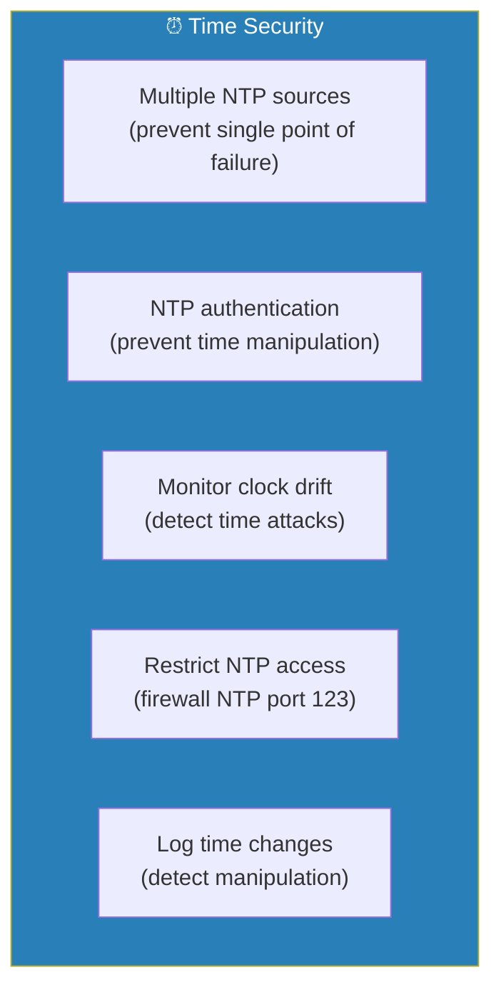

### 8.11.1 NTP Hardening

```bash
# Use systemd-timesyncd with multiple servers
sudo cat > /etc/systemd/timesyncd.conf << 'EOF'
[Time]
NTP=ntp.ubuntu.com time.google.com time.cloudflare.com
FallbackNTP=pool.ntp.org
RootDistanceMaxSec=1
EOF

sudo systemctl restart systemd-timesyncd

# Monitor time synchronization
timedatectl timesync-status

# Alert on significant time changes
sudo cat > /etc/rsyslog.d/10-time-changes.conf << 'EOF'
:msg, contains, "Time has been changed" /var/log/time-changes.log
& stop
EOF

sudo systemctl restart rsyslog

# Check time drift
timedatectl timesync-status | grep "Offset"
```

---

## 8.12 Verification Checklist


---

## Dependencies

- **Phases 1-7**: All baseline infrastructure must be operational
- **→ Phase 8 can be implemented incrementally** — not all at once. Prioritize:
  1. Kernel hardening (sysctl)
  2. Container security (pinning, overrides)
  3. File integrity monitoring (AIDE)
  4. Forensic readiness (snapshot script)
  5. Honeypot anti-detection
  6. Advanced network security
  7. Supply chain verification
  8. DNS/NTP hardening

---

## Notes & Decisions

| Decision | Rationale |
|----------|-----------|
| AppArmor over SELinux | Ubuntu 22.04 ships with AppArmor enabled by default. SELinux requires additional packages. |
| AIDE for file integrity | Lightweight, well-tested, simple configuration. Better than custom scripts. |
| Pinned digests over tags | Tags can be mutated. SHA-256 digests are immutable and verifiable. |
| Egress logging (not blocking) | Cannot block all outbound (needs DNS, updates). Logging detects anomalies. |
| No Falco/runtime security | Adds significant complexity and resource usage. AIDE + monitoring covers most cases. |
| Honeypot deception lightweight | No additional services or complex JavaScript frameworks. Simple HTML/CSS/JS. |
| Forensic snapshot script | Manual trigger + scheduled. Not fully automated to avoid alerting attackers. |
